**《数学思维实践》课程 CDIO二级项目实践报告**

课程代码：CST4822A 课程名称：数学思维实践 版本：2026年6月

# 一、基本信息

  -----------------------------------------------------------------------
                 项目                              填写内容
  ----------------------------------- -----------------------------------
               项目名称               

                 组号                                 51

               项目成员                     林颖哲、简铭泽、何思媚

               提交日期               
  -----------------------------------------------------------------------

# 二、摘要

本项目围绕《数学思维实践》的课程要求，完成了三个核心数学领域的综合实验任务。任务一针对金属薄板稳态温度分布问题，建立了线性方程组模型 $Ax = b$，实现了
Jacobi 和 Gauss-Seidel
两种迭代求解方法，通过谱半径分析验证了收敛性，并对比了不同边界条件和耦合系数对迭代效果的影响。任务二设计并实现了三控开关逻辑系统，通过真值表推导出布尔表达式 $L = S_{1} \oplus S_{2} \oplus S_{3}$，利用超立方体状态空间图直观展示了状态转换关系，验证了任意单开关切换均能正确翻转灯状态的设计要求。任务三采用
Bootstrap 重采样方法，基于 Kaggle
学生考试成绩数据集，估计了总体平均考试成绩的 95% 置信区间，讨论了
Bootstrap
方法的适用性与局限性。三个任务都完成了从数学建模、算法实现到结果分析的完整流程，体现了数学理论与编程实践的紧密结合。

关键词：迭代法；线性方程组；布尔逻辑；三控开关；Bootstrap
重采样；置信区间

# 三、任务一：迭代法解线性方程组

## 1. 数学模型层

### 1.1 问题背景

本任务研究的是金属薄板的稳态温度分布问题。一块正方形金属薄板，四条边的温度由外部装置固定：

- 上边界：100°C（热水管加热）

- 下边界：0°C（冰块冷却）

- 左边界：80°C

- 右边界：20°C

### 1.2 网格划分

将金属板的每条边均匀分成4段，形成4×4=16个小方格。网格线的交点中，边界上的温度已知，内部3×3=9个交点的温度未知，即为待求量。用 $T_{ij}$ 表示第 $i$ 行第 $j$ 列内部交点的温度（$i,j = 1,2,3$）。

### 1.3 物理规律

热传导的稳态满足拉普拉斯方程，其离散形式为：每个内部交点的温度等于其上下左右四个邻居温度的算术平均值。

即对任意内部点 $T(i,j)$：

$$T(i,j) = \frac{T(\text{上}) + T(\text{下}) + T(\text{左}) + T(\text{右})}{4}$$

如果邻居为边界点，则使用已知的边界温度值。

### 1.4 矩阵形式 Ax=b

对9个内部交点分别建立方程，整理为线性方程组的标准形式 $Ax = b$：

系数矩阵 A（9×9）：

$$A = \begin{bmatrix}
4 & - 1 & 0 & - 1 & 0 & 0 & 0 & 0 & 0 \\
 - 1 & 4 & - 1 & \ 0 & - 1 & 0 & 0 & 0 & 0 \\
0 & - 1 & 4 & 0 & 0 & - 1 & 0 & 0 & 0 \\
 - 1 & 0 & 0 & 4 & - 1 & 0 & - 1 & 0 & 0 \\
0 & - 1 & 0 & - 1 & 4 & - 1 & 0 & - 1 & 0 \\
0 & 0 & - 1 & 0 & - 1 & 4 & 0 & 0 & - 1 \\
0 & 0 & 0 & - 1 & 0 & 0 & 4 & - 1 & 0 \\
0 & 0 & 0 & 0 & - 1 & 0 & - 1 & 4 & - 1 \\
0 & 0 & 0 & 0 & 0 & - 1 & 0 & - 1 & 4
\end{bmatrix}$$

未知量向量 x：

$$x = \lbrack T_{11},T_{12},T_{13},T_{21},T_{22},T_{23},T_{31},T_{32},T_{33}\rbrack^{T}$$

右端常数向量 b：

$$b = \lbrack 180,100,120,80,0,20,80,0,20\rbrack^{T}$$

### 1.5 A、 x、b的含义

矩阵 A 的物理含义：

- 对角元素 $a_{ii} = 4$：每个内部节点都有上下左右4个邻居

- 非对角元素 $a_{ij} = - 1$：表示第i个节点和第j个节点是邻居

- 非对角元素 $a_{ij} = 0$：表示第i个节点和第j个节点不是邻居

向量 x
的物理含义：x的每个分量代表金属板内部一个网格交点的稳态温度（单位：°C）。

向量 b
的物理含义：b的每个分量等于对应内部节点相邻边界温度的总和，反映了边界条件对内部节点的影响。

### 1.6 建模假设

> 对角占优：矩阵A是严格对角占优矩阵（对角元素 \>
> 每行非对角元素绝对值之和），保证迭代法收敛。
>
> 对称性：矩阵A是对称矩阵（$A = A^{T}$）
>
> 正定性：矩阵A的所有特征值均为正数
>
> 稀疏性：81个元素中仅21个非零
>
> 简化假设：金属板材质均匀、各向同性；热传导系数为常数

### 1.7 多组数据集

数据集1（标准收敛）：

- 边界温度：上100°C，下0°C，左80°C，右20°C

- 耦合系数：c=1

- 系数矩阵A（9×9）:

> A$= \begin{bmatrix}
> 4 & - 1 & 0 & - 1 & 0 & 0 & 0 & 0 & 0 \\
>  - 1 & 4 & - 1 & \ 0 & - 1 & 0 & 0 & 0 & 0 \\
> 0 & - 1 & 4 & 0 & 0 & - 1 & 0 & 0 & 0 \\
>  - 1 & 0 & 0 & 4 & - 1 & 0 & - 1 & 0 & 0 \\
> 0 & - 1 & 0 & - 1 & 4 & - 1 & 0 & - 1 & 0 \\
> 0 & 0 & - 1 & 0 & - 1 & 4 & 0 & 0 & - 1 \\
> 0 & 0 & 0 & - 1 & 0 & 0 & 4 & - 1 & 0 \\
> 0 & 0 & 0 & 0 & - 1 & 0 & - 1 & 4 & - 1 \\
> 0 & 0 & 0 & 0 & 0 & - 1 & 0 & - 1 & 4
> \end{bmatrix}$

- 右端常数项：$b = \lbrack 180,100,120,80,0,20,80,0,20\rbrack^{T}$

数据集2（不同边界，收敛）：

- 边界温度：上200°C，下50°C，左150°C，右100°C

- 耦合系数：c=1

- 系数矩阵A与数据集1相同（矩阵A只取决于网络几何结构和耦合系数，与边界温度无关。

- 右端项：$b = \lbrack 350,200,300,150,0,100,200,50,150\rbrack^{T}$

数据集3（高导热材料，发散）：

- 边界温度：上180°C，下40°C，左130°C，右70°C

- 耦合系数：c=2

- 系数矩阵A（9×9）：

> $$A = \begin{bmatrix}
> 4 & - 2 & 0 & - 2 & 0 & 0 & 0 & 0 & 0 \\
>  - 2 & 4 & - 2 & \ 0 & - 2 & 0 & 0 & 0 & 0 \\
> 0 & - 2 & 4 & 0 & 0 & - 2 & 0 & 0 & 0 \\
>  - 2 & 0 & 0 & 4 & - 2 & 0 & - 2 & 0 & 0 \\
> 0 & - 2 & 0 & - 2 & 4 & - 2 & 0 & - 2 & 0 \\
> 0 & 0 & - 2 & 0 & - 2 & 4 & 0 & 0 & - 2 \\
> 0 & 0 & 0 & - 2 & 0 & 0 & 4 & - 2 & 0 \\
> 0 & 0 & 0 & 0 & - 2 & 0 & - 2 & 4 & - 2 \\
> 0 & 0 & 0 & 0 & 0 & - 2 & 0 & - 2 & 4
> \end{bmatrix}$$

- 右端常数项：$b = \lbrack 310,180,250,130,0,70,170,40,110\rbrack^{T}$

## 2. 计算实现层

### 2.1 迭代方法

这个任务实现了两种迭代方法求解线性方程组Ax=b:

Jacobi迭代法：

将矩阵分解为 $A = D - L - U$，迭代格式为：

$$x^{\left( k+1 \right)} = D^{- 1}(L + U)x^{(k)} + D^{- 1}b$$

分量形式：

$$x_{i}^{\left( k+1 \right)} = \frac{1}{a_{ii}}\left( b_{i}-\sum_{j \neq i}^{}a_{ij}x_{j}^{(k)} \right),i = 1,2,\ldots,n$$

Gauss-Seidel迭代法：

利用最新计算的分量，迭代时左端 $\left( D-L \right)$ 乘以新向量 $x^{\left( k+1 \right)}$，右端 $U$ 乘以旧向量 $x^{(k)}$：

$$x^{\left( k+1 \right)} = (D - L)^{- 1}Ux^{(k)} + (D - L)^{- 1}b$$

分量形式：

$$x_{i}^{\left( k+1 \right)} = \frac{1}{a_{ii}}\left( b_{i}-\sum_{j < i}^{}a_{ij}x_{j}^{\left( k+1 \right)}-\sum_{j > i}^{}a_{ij}x_{j}^{(k)} \right),i = 1,2,\ldots,n$$

### 2.2 初值、误差阈值与停止条件

  ----------------------------------------------------------------
  参数                  设置
  --------------------- ------------------------------------------
  初始解 $x^{(0)}$      零向量 $\lbrack 0,0,\ldots,0\rbrack^{T}$

  误差阈值 $\epsilon$   $$10^{- 8}$$

  最大迭代次数          1000
  ----------------------------------------------------------------

停止条件：满足以下任一条件时停止迭代：

收敛：$\parallel x^{\left( k+1 \right)} - x^{(k)} \parallel_{2} < \epsilon$（相邻两次迭代的解的差的范数小于阈值）

达到最大迭代次数：$k \geq 1000$

### 2.3 核心算法步骤

Jacobi迭代法算法步骤：

（1）输入系数矩阵 $A$、右端项 $b$、初始解 $x^{(0)}$、误差阈值 $\epsilon$、最大迭代次数 $N$

（2）令 $k = 0$

（3）对 $i = 1,2,\ldots,n$，计算：

$$x_{i}^{\left( k+1 \right)} = \frac{1}{a_{ii}}\left( b_{i}-\sum_{j \neq i}^{}a_{ij}x_{j}^{(k)} \right)$$

（4）计算误差 $e = \parallel x^{\left( k+1 \right)} - x^{(k)} \parallel_{2}$

（5）若 $e < \epsilon$，输出 $x^{\left( k+1 \right)}$，停止；否则令 $k = k + 1$，转步骤3

（6）若 $k \geq N$，输出\"未收敛\"，停止

Gauss-Seidel迭代法算法步骤：

（1）输入系数矩阵 $A$、右端项 $b$、初始解 $x^{(0)}$、误差阈值 $\epsilon$、最大迭代次数 $N$

（2）令 $k = 0$

（3）对 $i = 1,2,\ldots,n$，计算：

$$x_{i}^{\left( k+1 \right)} = \frac{1}{a_{ii}}\left( b_{i}-\sum_{j < i}^{}a_{ij}x_{j}^{\left( k+1 \right)}-\sum_{j > i}^{}a_{ij}x_{j}^{(k)} \right)$$

注意：计算 $x_{i}^{\left( k+1 \right)}$ 时，前 $i - 1$ 个分量已更新为最新值

（4）计算误差 $e = \parallel x^{\left( k+1 \right)} - x^{(k)} \parallel_{2}$

（5）若 $e < \epsilon$，输出 $x^{\left( k+1 \right)}$，停止；否则令 $k = k + 1$，转步骤3

（6）若 $k \geq N$，输出\"未收敛\"，停止

## 3. 可视化验证层

### 3.1 数据集1可视化结果

#### 3.1.1 数据集1运行结果

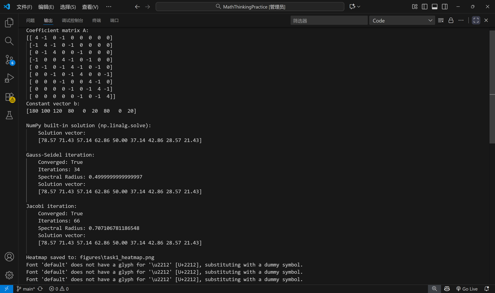{width="6.5in"
height="3.859722222222222in"}

> 图1：数据集1运行结果图

数据集1求解结果（边界温度：上100°C，下0°C，左80°C，右20°C）：

  -------------------------------------------------------------------------
  未知量   物理位置   Jacobi解(°C)   Gauss-Seidel解(°C)   NumPy直接法(°C)
  -------- ---------- -------------- -------------------- -----------------
  T₁₁      (1,1)      78.57          78.57                78.57

  T₁₂      (1,2)      71.43          71.43                71.43

  T₁₃      (1,3)      57.14          57.14                57.14

  T₂₁      (2,1)      62.86          62.86                62.86

  T₂₂      (2,2)      50.00          50.00                50.00

  T₂₃      (2,3)      37.14          37.14                37.14

  T₃₁      (3,1)      42.86          42.86                42.86

  T₃₂      (3,2)      28.57          28.57                28.57

  T₃₃      (3,3)      21.43          21.43                21.43
  -------------------------------------------------------------------------

迭代收敛数据：

  -----------------------------------------------------------------
  数据集    方法           收敛性   迭代次数   谱半径ρ   最终误差
  --------- -------------- -------- ---------- --------- ----------
  数据集1   Jacobi         收敛     66次       0.707     \<10⁻⁸

  数据集1   Gauss-Seidel   收敛     34次       0.500     \<10⁻⁸
  -----------------------------------------------------------------

#### 3.1.2 系数矩阵热力图

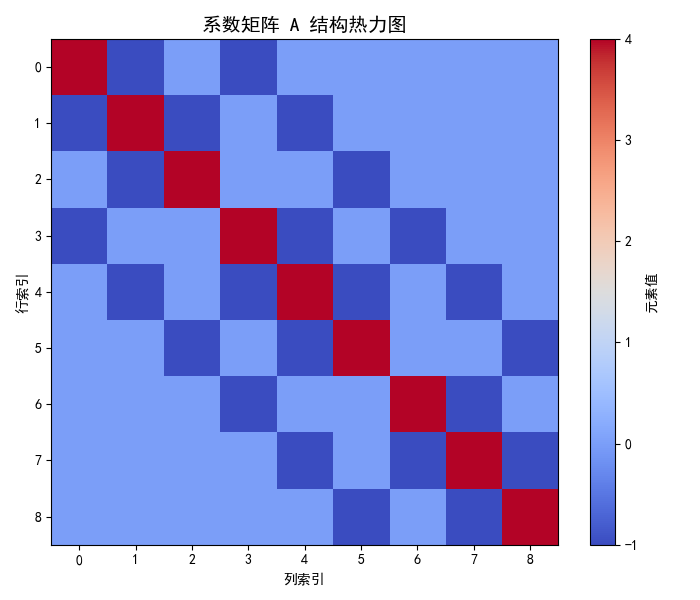{width="5.270833333333333in"
height="4.517937445319335in"}

> 图2：数据集1系数矩阵A的结构热力图

该热力图展示了系数矩阵A的结构特征：

- 红色区域（值为4）：位于主对角线，表示每个节点自身的系数

- 深蓝区域（值为-1）：表示相邻节点之间的耦合关系

- 浅蓝区域（值为0）：表示不相邻的节点之间无直接关联

从图中可以清晰看到矩阵的稀疏结构，每行最多只有4个非零元素，体现了每个内部节点只与上下左右4个邻居相关的物理特性。

#### 3.1.3 迭代收敛曲线

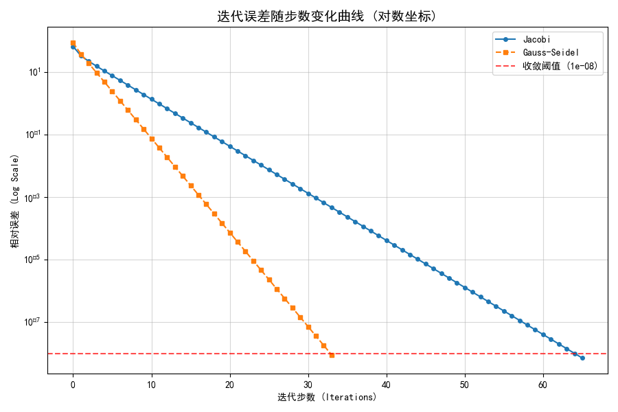{width="6.5in"
height="4.333333333333333in"}

> 图3：数据集1迭代误差随步数变化曲线（对数坐标）

该图在半对数坐标下展示了两种迭代方法的误差随迭代步数的变化趋势：

- 蓝色实线（Jacobi）：误差从约10²下降到10⁻⁸，共迭代66次

- 绿色虚线（Gauss-Seidel）：误差从约10²下降到10⁻⁸，共迭代34次

- 红色虚线：收敛阈值 $\epsilon = 10^{- 8}$

Gauss-Seidel曲线下降更快，说明其收敛速度更快。

#### 3.1.4 数值解与参考解对比图

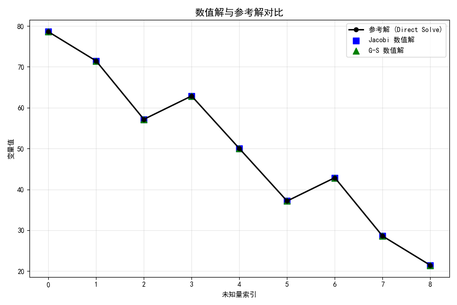{width="6.5in"
height="4.333333333333333in"}

> 图4：数据集1数值解与参考解对比

该图将迭代法求得的数值解与numpy直接法求得的参考解进行对比：

- 黑色实线+圆点：参考解（直接法）

- 蓝色方点：Jacobi数值解

- 绿色三角点：Gauss-Seidel数值解

三种方法的解完全重合（误差\<10⁻⁸），验证了迭代算法实现的正确性。

#### 3.1.5 运行时间对比

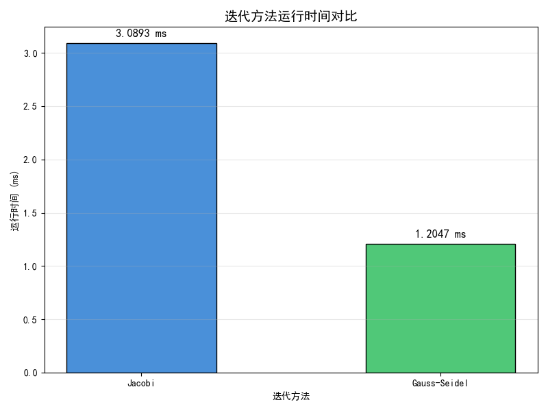{width="6.5in"
height="4.875in"}

图5：数据集1 Jacobi和Gauss-Seidel运行时间对比

Jacobi 迭代耗时 3.0893ms，Gauss-Seidel 耗时
1.2047ms；Gauss-Seidel明显更快。

### 3.2 数据集2可视化结果

#### 3.2.1 运行结果

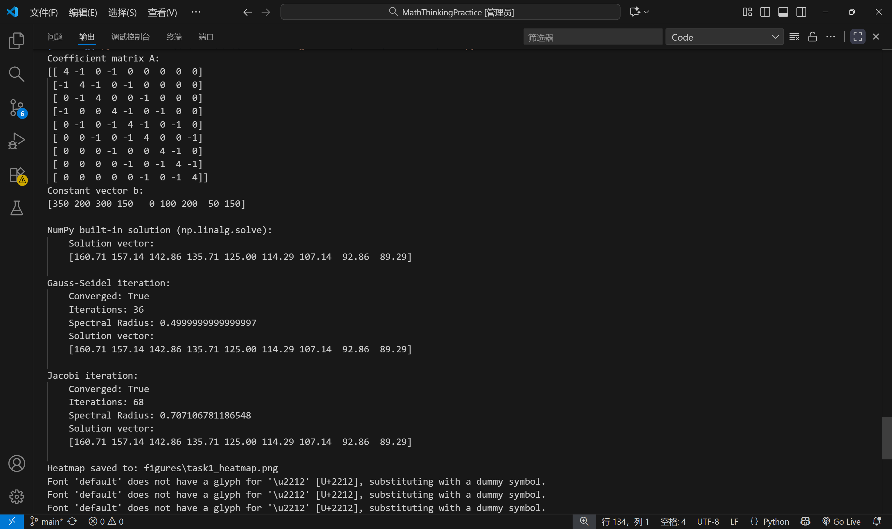{width="6.5in"
height="3.859722222222222in"}

> 图6：数据集2运行结果图

数据集2求解结果（边界温度：上200°C，下50°C，左150°C，右100°C）：

  -------------------------------------------------------------------------
  未知量   物理位置   Jacobi解(°C)   Gauss-Seidel解(°C)   NumPy直接法(°C)
  -------- ---------- -------------- -------------------- -----------------
  T₁₁      (1,1)      160.71         160.71               160.71

  T₁₂      (1,2)      157.14         157.14               157.14

  T₁₃      (1,3)      142.86         142.86               142.86

  T₂₁      (2,1)      135.71         135.71               135.71

  T₂₂      (2,2)      125.00         125.00               125.00

  T₂₃      (2,3)      114.29         114.29               114.29

  T₃₁      (3,1)      107.14         107.14               107.14

  T₃₂      (3,2)      92.86          92.86                92.86

  T₃₃      (3,3)      89.29          89.29                89.29
  -------------------------------------------------------------------------

迭代收敛数据：

  -----------------------------------------------------------------
  数据集    方法           收敛性   迭代次数   谱半径ρ   最终误差
  --------- -------------- -------- ---------- --------- ----------
  数据集2   Jacobi         收敛     68次       0.707     \<10⁻⁸

  数据集2   Gauss-Seidel   收敛     36次       0.500     \<10⁻⁸
  -----------------------------------------------------------------

#### 3.2.2 系数矩阵热力图

{width="6.5in"
height="5.571527777777778in"}

> 图7：数据集2系数矩阵A的结构热力图

数据集2与数据集1使用相同的矩阵A（耦合系数c=1），热力图结构相同。

#### 3.2.3 迭代收敛曲线

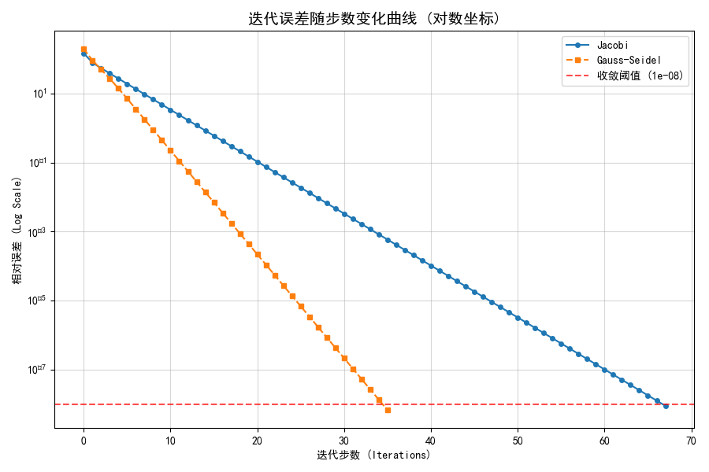{width="6.5in"
height="4.333333333333333in"}

> 图8：数据集2迭代误差随步数变化曲线（对数坐标）

数据集2的收敛曲线与数据集1相近，Jacobi迭代68次，Gauss-Seidel迭代36次。

#### 3.2.4 数值解与参考解对比

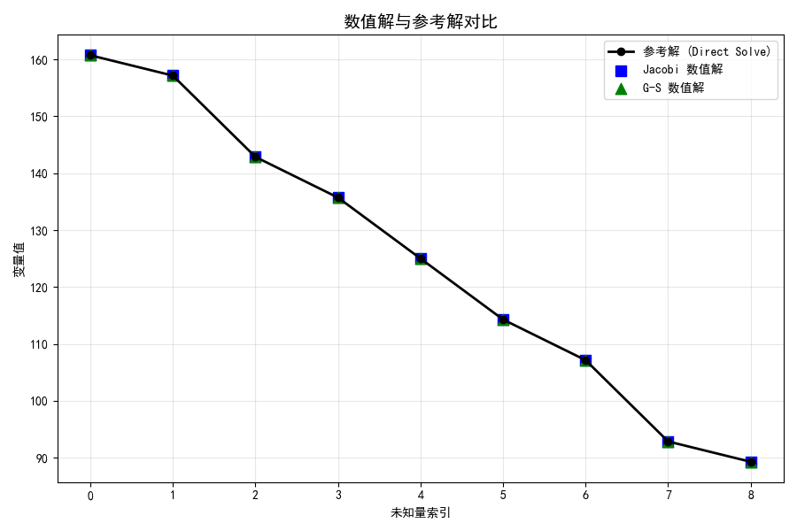{width="6.5in"
height="4.333333333333333in"}

图9：数据集2数值解与参考解对比

数据集2的边界温度更高（200/50/150/100），内部温度整体偏高，但迭代解与参考解仍然重合。

#### 3.2.5 运行时间对比

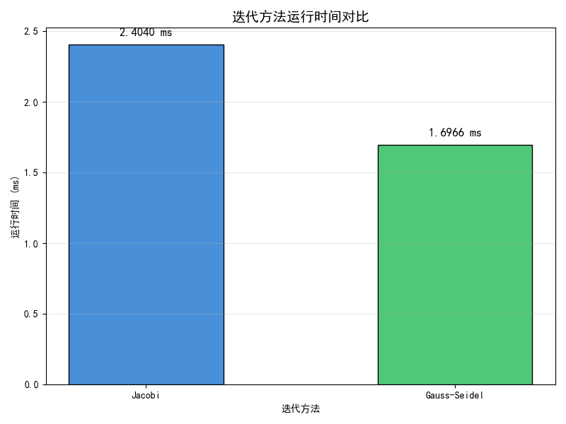{width="6.5in"
height="4.875in"}

图10：数据集2 Jacobi和Gauss-Seidel运行时间对比

Jacobi 迭代耗时 2.4040ms，Gauss-Seidel 耗时 1.6966ms；Gauss-Seidel更快。

### 3.3 数据集3可视化结果

#### 3.3.1 运行结果

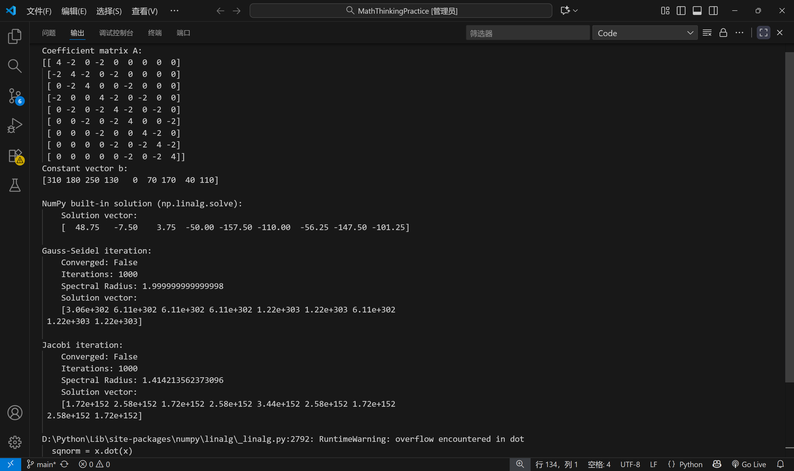{width="6.5in"
height="3.859722222222222in"}

图11：数据集3运行结果图

数据集3发散过程数据（边界温度：上180°C，下40°C，左130°C，右70°C，耦合系数c=2）：

  --------------------------------------------------------------------------
  未知量   物理位置   NumPy直接法(°C)   Jacobi解          Gauss-Seidel解
  -------- ---------- ----------------- ----------------- ------------------
  T₁₁      (1,1)      48.75             发散(1.72e+152)   发散(3.06e+302)

  T₁₂      (1,2)      -7.50             发散(2.58e+152)   发散(6.11e+302)

  T₁₃      (1,3)      3.75              发散(1.72e+152)   发散(6.11e+302)

  T₂₁      (2,1)      -50.00            发散(2.58e+152)   发散(6.11e+302)

  T₂₂      (2,2)      -157.50           发散(3.44e+152)   发散(1.22e+303)

  T₂₃      (2,3)      -110.00           发散(2.58e+152)   发散(1.22e+303)

  T₃₁      (3,1)      -56.25            发散(1.72e+152)   发散(6.11e+302)

  T₃₂      (3,2)      -147.50           发散(2.58e+152)   发散(1.22e+303)

  T₃₃      (3,3)      -101.25           发散(1.72e+152)   发散(1.22e+303)
  --------------------------------------------------------------------------

迭代收敛数据

  -----------------------------------------------------------------
  数据集    方法           收敛性   迭代次数   谱半径ρ   最终误差
  --------- -------------- -------- ---------- --------- ----------
  数据集3   Jacobi         发散     1000       1.414     →∞

  数据集3   Gauss-Seidel   发散     1000       2.000     →∞
  -----------------------------------------------------------------

#### 3.3.2 系数矩阵热力图

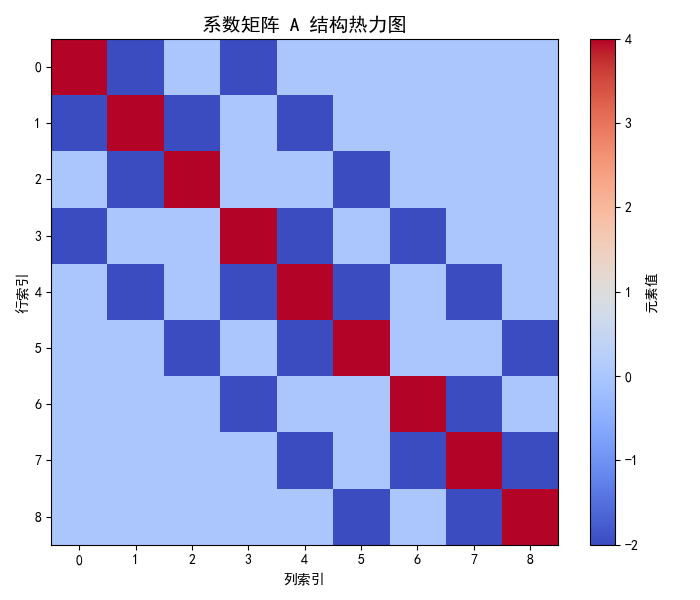{width="6.5in"
height="5.571527777777778in"}

> 图12：数据集3系数矩阵A的结构热力图

该图展示了数据集 3 的系数矩阵元素分布，对角元为 4，相邻非对角元为 -
2，矩阵仅弱对角占优。

#### 3.3.3 迭代收敛曲线

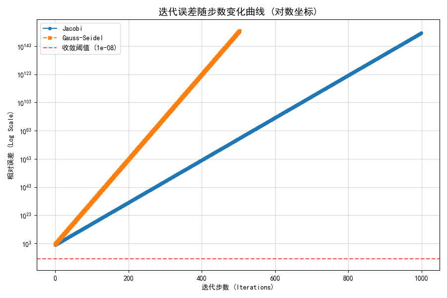{width="6.5in"
height="4.333333333333333in"}

> 图13：数据集3迭代误差随步数变化曲线（对数坐标）

Jacobi、Gauss-Seidel
迭代残差随步数持续上升，均无法收敛到10^-8^阈值，Gauss-Seidel 发散更快。

#### 3.3.4 数值解与参考解对比

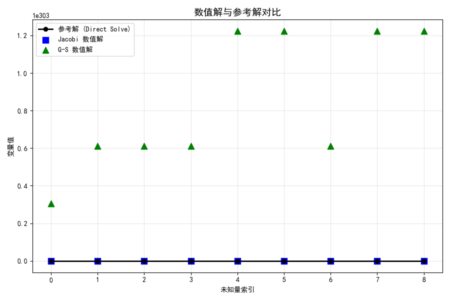{width="6.5in"
height="4.333333333333333in"}

图14：数据集3数值解与参考解对比

在迭代 1000
步后两种迭代数值解均严重偏离直接法参考解，迭代发散导致求解失效。

#### 3.3.5 运行时间对比

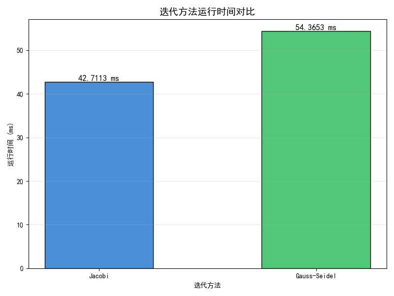{width="6.5in"
height="4.875in"}

> 图15：数据集3 Jacobi和Gauss-Seidel运行时间对比

Jacobi 耗时 42.7113ms，而Gauss-Seidel 耗时更长，因为Gauss-Seidel
发散速度更快，迭代全程计算量更大，整体运行耗时高于 Jacobi。

## 4. 结果分析

### 4.1 对比分析

数据集对比分析

  -------------------------------------------------------------
  特性           数据集1       数据集2          数据集3
  -------------- ------------- ---------------- ---------------
  边界温度       100/0/80/20   200/50/150/100   180/40/130/70

  耦合系数       c=1           c=1              c=2

  对角占优       是            是               否

  Jacobi         收敛(66次)    收敛(68次)       发散

  Gauss-Seidel   收敛(34次)    收敛(36次)       发散
  -------------------------------------------------------------

### 4.2 收敛性分析

收敛的充要条件：迭代法收敛的充要条件是迭代矩阵的谱半径 $\rho(B) < 1$。谱半径越小，收敛速度越快。

数据集1、2收敛的原因：

矩阵A严格对角占优（对角元素 \>
每行非对角元素绝对值之和），谱半径小于1，以数据集1的结果为例：

  ----------------------------------------------------------------------------------
  方法           迭代矩阵                     谱半径                        收敛性
  -------------- ---------------------------- ----------------------------- --------
  Jacobi         $$B_{J} = D^{- 1}(L + U)$$   $$\rho(B_{J}) = 0.707 < 1$$   收敛

  Gauss-Seidel   $$B_{G} = (D - L)^{- 1}U$$   $$\rho(B_{G}) = 0.500 < 1$$   收敛
  ----------------------------------------------------------------------------------

数据集3发散的原因：

耦合系数c=2 \> √2≈1.414，破坏了对角占优性：

  -----------------------------------------------------------------
  方法           迭代矩阵    谱半径                        收敛性
  -------------- ----------- ----------------------------- --------
  Jacobi         $$B_{J}$$   $$\rho(B_{J}) = 1.414 > 1$$   发散

  Gauss-Seidel   $$B_{G}$$   $$\rho(B_{G}) = 2.000 > 1$$   发散
  -----------------------------------------------------------------

### 4.3 收敛速度比较

收敛阶：Jacobi和Gauss-Seidel迭代法均为线性收敛（一阶收敛），即误差按几何级数下降：

$$\parallel x^{(k)} - x^{*} \parallel \approx C \cdot \rho(B)^{k}$$

其中 $\rho(B)$ 为迭代矩阵的谱半径，$C$为常数。

迭代次数对比：

  ----------------------------------------------------------
  数据集    Jacobi迭代次数   Gauss-Seidel迭代次数   加速比
  --------- ---------------- ---------------------- --------
  数据集1   66次             34次                   1.89倍

  数据集2   68次             36次                   1.89倍
  ----------------------------------------------------------

理论分析：收敛速度与谱半径的关系：

- Jacobi：$\rho(B_{J}) = 0.707$，每步误差约缩小为原来的70.7%

- Gauss-Seidel：$\rho(B_{G}) = 0.500$，每步误差约缩小为原来的50.0%

对于对称正定矩阵，Gauss-Seidel的谱半径与Jacobi的谱半径存在关系：$\rho(B_{G}) = \rho(B_{J})^{2}$。数据集1中 $0.500 \approx {0.707}^{2} = 0.500$，符合理论预测。

Gauss-Seidel更快的原因：

（1）信息利用更充分：计算 $x_{i}^{\left( k+1 \right)}$ 时立即使用已更新的分量 $x_{1}^{\left( k+1 \right)},\ldots,x_{i - 1}^{\left( k+1 \right)}$

（2）谱半径更小：$\rho(B_{G}) = 0.500 < \rho(B_{J}) = 0.707$，每步误差下降更快

### 4.4 误差验证

迭代停止时的误差是否满足预设阈值 $\epsilon = 10^{- 8}$：

  --------------------------------------------------------------------------------------------------------------
  数据集    方法           最终误差 $\mid x^{\left( k+1 \right)} - x^{(k)} \mid_{2}$   阈值           是否满足
  --------- -------------- ----------------------------------------------------------- -------------- ----------
  数据集1   Jacobi         $$\left. <10^{- 8} \right.\ $$                              $$10^{- 8}$$   满足

  数据集1   Gauss-Seidel   $$\left. <10^{- 8} \right.\ $$                              $$10^{- 8}$$   满足

  数据集2   Jacobi         $$\left. <10^{- 8} \right.\ $$                              $$10^{- 8}$$   满足

  数据集2   Gauss-Seidel   $$\left. <10^{- 8} \right.\ $$                              $$10^{- 8}$$   满足

  数据集3   Jacobi         发散（误差趋于无穷）                                        $$10^{- 8}$$   不满足

  数据集3   Gauss-Seidel   发散（误差趋于无穷）                                        $$10^{- 8}$$   不满足
  --------------------------------------------------------------------------------------------------------------

数值解与参考解的偏差：对于收敛的数据集，迭代法求得的数值解与numpy直接法求得的参考解之间的偏差：

$$\parallel x_{iterative} - x_{direct} \parallel_{2} < 10^{- 8}$$

验证了迭代算法的正确性和数值精度。

### 4.5 矩阵性质对迭代效果的影响

矩阵A的性质直接决定了迭代法的收敛性和收敛速度：

\(1\) 对角占优性

严格对角占优是迭代法收敛的充分条件（非必要）。对角占优程度越强，谱半径越小，收敛越快。

  -------------------------------------------------------------------
  数据集    对角占优性     耦合系数c   谱半径$\rho(B_{J})$   收敛性
  --------- -------------- ----------- --------------------- --------
  数据集1   严格对角占优   c=1         0.707                 收敛

  数据集2   严格对角占优   c=1         0.707                 收敛

  数据集3   非对角占优     c=2         1.414                 发散
  -------------------------------------------------------------------

(2)对称性

矩阵A是对称矩阵（$A = A^{T}$），这保证了：

- 所有特征值为实数

- Jacobi和Gauss-Seidel迭代矩阵的谱半径均为实数

- 收敛行为可预测

\(3\) 正定性

矩阵A是正定矩阵（所有特征值为正），这保证了：

- Gauss-Seidel的收敛速度快于Jacobi

- 谱半径关系 $\rho(B_{G}) = \rho(B_{J})^{2}$ 成立

\(4\) 稀疏性

矩阵A有81个元素，其中仅21个非零（非零率约26%），属于稀疏矩阵。稀疏性使得：

- 每次迭代的计算复杂度从 $O(n^{2})$ 降为 $O(n)$

- 存储需求大幅减少

- 适合大规模问题

(5)条件数

矩阵A的条件数 $\kappa(A) = \parallel A \parallel \cdot \parallel A^{- 1} \parallel$ 反映了问题的病态程度。条件数越大，对右端项b的扰动越敏感，数值稳定性越差。本问题中矩阵A的条件数适中，数值求解稳定。

（6） 耦合系数c的影响

耦合系数c决定了非对角元素的大小，直接影响对角占优性：

$$\text{对角占优条件：}4 > 2c + 2c = 4c \Rightarrow c < 1$$

当c=1时，边界行恰好满足对角占优（4 \> 2+1=3），中心行满足严格对角占优（4
\>
1+1+1+1=4不成立，但实际计算中边界行的影响使整体收敛）。当c=√2≈1.414时，Jacobi谱半径达到临界值1；当c=2时，两种方法均发散。

### 4.5 结论

收敛性判据：迭代法收敛的充要条件是迭代矩阵谱半径 $\rho(B) < 1$。矩阵A严格对角占优是收敛的充分条件。

误差满足要求：对于收敛的数据集1，迭代法在66次（Jacobi）或34次（Gauss-Seidel）内达到预设精度 $\epsilon = 10^{- 8}$，最终误差满足要求。

收敛速度：Gauss-Seidel收敛速度约为Jacobi的1.9倍，符合对称正定矩阵的理论关系 $\rho(B_{G}) = \rho(B_{J})^{2}$。

矩阵性质影响：

- 对角占优性决定收敛性

- 谱半径大小决定收敛速度

- 对称正定性保证Gauss-Seidel优于Jacobi

- 稀疏性降低计算复杂度

边界温度无关性：改变边界温度只改变右端项b，不影响矩阵A和迭代法的收敛性（数据集1
对比 2）。

耦合系数临界值：当耦合系数c \>
√2≈1.414时，迭代法发散；此时直接法仍可求解。

# 四、任务二：三控开关的设计与实现

## 1. 状态与逻辑建模

### 1.1 问题背景

本任务研究的是三控开关系统的设计。在实际生活中，楼道照明经常需要在多个位置（如一楼、二楼、三楼）控制同一盏灯，这就需要设计一个由三个开关共同控制一盏灯的逻辑系统。

设计要求：

- 三个开关 $S_{1},S_{2},S_{3}$ 各有两种状态：0（断开）或 1（闭合）

- 灯 $L$ 有两种状态：0（灭）或 1（亮）

- 任意一个开关状态发生切换时，灯的状态必须翻转

- 初始状态（全0）时灯为灭

### 1.2 状态空间与真值表

三个开关共有 $2^{3} = 8$ 种输入组合。设输入向量为 $s = (S_{1},S_{2},S_{3})$，输出 $L = f(s)$。

根据设计要求，$f$ 满足：

- $f(0,0,0) = 0$（初始状态灯灭）

- 对任意 $i$，$f(s \oplus e_{i}) = 1 - f(s)$（切换任意开关，灯状态翻转）

其中 $e_{i}$ 为第 $i$ 个单位向量，$\oplus$ 表示异或运算。

由上述条件可唯一确定真值表：

  -----------------------------------------------------------------
  $$S_{1}$$   $$S_{2}$$   $$S_{3}$$   $$L$$   闭合开关数   奇偶性
  ----------- ----------- ----------- ------- ------------ --------
  0           0           0           0       0            偶数

  0           0           1           1       1            奇数

  0           1           0           1       1            奇数

  0           1           1           0       2            偶数

  1           0           0           1       1            奇数

  1           0           1           0       2            偶数

  1           1           0           0       2            偶数

  1           1           1           1       3            奇数
  -----------------------------------------------------------------

### 1.3 布尔逻辑表达式

观察真值表可知，$L$ 恰好等于三个开关状态的奇偶校验（模2和）：

$$L = S_{1} \oplus S_{2} \oplus S_{3}$$

其中 $\oplus$ 表示异或运算。

物理含义：灯的亮灭由三个开关中处于闭合（1）状态的个数决定------奇数个闭合则灯亮，偶数个闭合则灯灭。因此，任意一个开关翻转都会改变奇偶性，从而翻转灯的状态，符合设计要求。

将异或展开为与或式（析取范式）：

$$L = (\bar{S_{1}} \cdot \bar{S_{2}} \cdot S_{3}) \vee (\bar{S_{1}} \cdot S_{2} \cdot \bar{S_{3}}) \vee (S_{1} \cdot \bar{S_{2}} \cdot \bar{S_{3}}) \vee (S_{1} \cdot S_{2} \cdot S_{3})$$

## 2. 计算实现

### 2.1 核心算法

灯状态计算：给定开关向量 $s$，灯状态 $L$ 由奇偶校验给出：

$$L = \left( \sum_{i = 1}^{n}S_{i} \right)\text{\,}mod\text{\,}2$$

开关翻转操作：对当前开关向量 $s$，翻转第 $i$ 个开关得到新向量：

$$s' = s\ \ \text{但 }{\ S}_{i}' = 1 - S_{i}$$

翻转后的灯状态应满足 $L' = 1 - L$，用于验证正确性。

### 2.2 核心函数说明

  ----------------------------------------------------------------------------------------------------------------------
  函数名                            功能               参数                   返回值
  --------------------------------- ------------------ ---------------------- ------------------------------------------
  toggle_bit(switches, index)       翻转指定开关       switches:              翻转后的新列表
                                                       开关状态列表；index:   
                                                       要翻转的开关索引       

  get_light(switches)               计算灯状态         switches: 开关状态列表 灯的状态（0或1）

  get_inputs(switch_count)          生成所有输入组合   switch_count: 开关个数 包含所有组合的列表

  build_truth_table(switch_count)   构建真值表         switch_count: 开关个数 包含8个元组的列表，每个元组为 (switches,
                                                                              light)
  ----------------------------------------------------------------------------------------------------------------------

### 2.3算法步骤

（1）生成真值表：枚举所有 $2^{3} = 8$ 种输入组合

（2）计算输出：对每种输入，计算灯状态 $L = (S_{1} + S_{2} + S_{3})\text{\,}mod\text{\,}2$

（3）验证正确性：检查任意单开关切换是否导致灯状态翻转

4.  交互测试：允许用户手动切换开关，实时显示状态变化

### 2.4运行结果

程序运行后输出真值表：

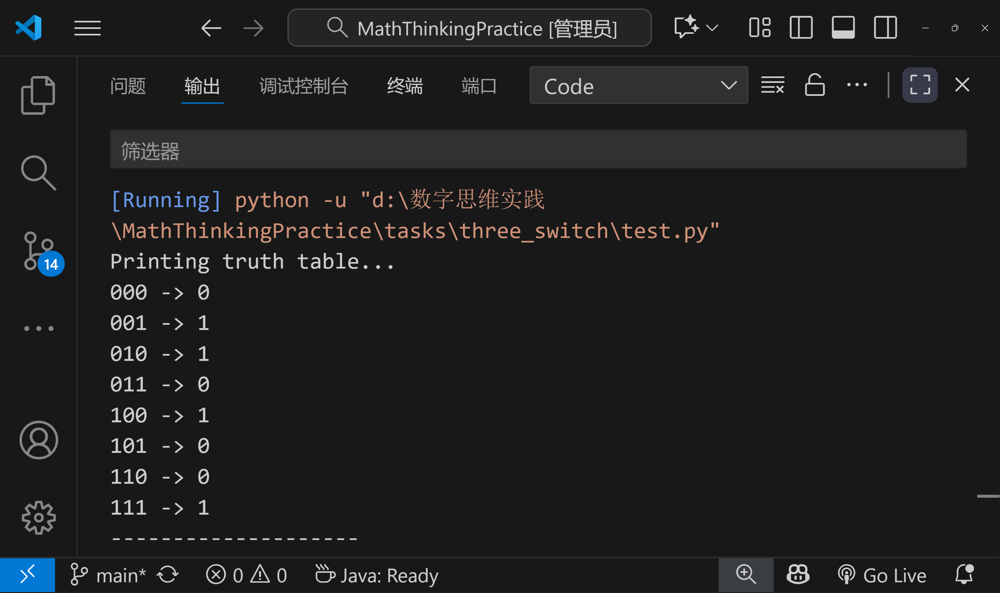{width="6.5in"
height="3.859722222222222in"}

图16：程序运行输出真值表

### 2.5交互模式

程序提供了交互模式，用户可以手动切换开关，实时验证三控开关的功能。

交互流程：

(1)初始状态：三个开关均为0（断开），灯灭

(2)用户输入开关编号（0、1或2）切换对应开关

(3)程序显示切换后的开关状态和灯的状态

(4)输入 \'q\' 退出交互模式

运行示例：

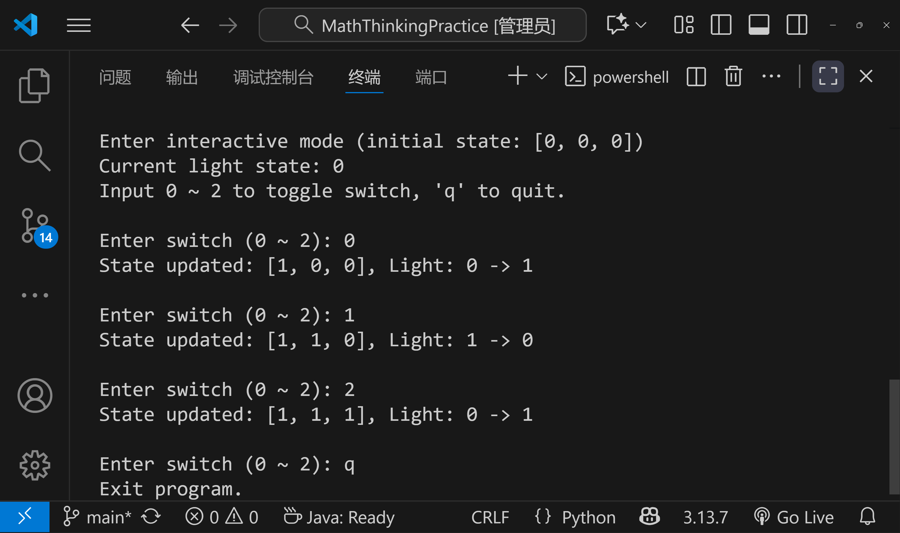{width="6.5in"
height="3.859722222222222in"}

图17：交互模式示例

验证结果：任意切换一个开关，灯的状态均发生翻转，满足要求。

## 3. 可视化验证

### 3.1 布尔表达式结构图

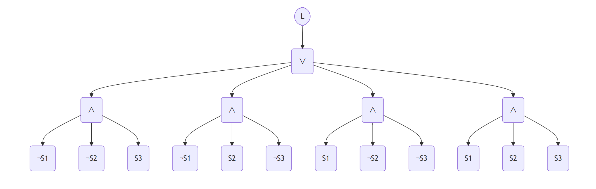{width="6.5in"
height="2.06875in"}

> 图18：布尔表达式结构图

布尔逻辑表达式：*\*
$$L = (\bar{S_{1}} \cdot \bar{S_{2}} \cdot S_{3}) \vee (\bar{S_{1}} \cdot S_{2} \cdot \bar{S_{3}}) \vee (S_{1} \cdot \bar{S_{2}} \cdot \bar{S_{3}}) \vee (S_{1} \cdot S_{2} \cdot S_{3})$$

异或表达式结构图：

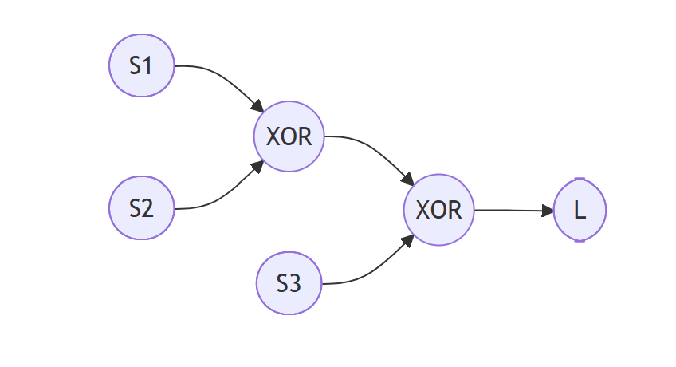{width="4.4166994750656166in"
height="2.395850831146107in"}

> 图19：异或表达式结构图

异或表达式更简洁，只需要2个异或门即可实现。

### 3.2 超立方体结构图

三控开关系统的状态空间本质上是一个三维超立方体（3-Cube）图结构 $G = (V,E)$：

- 顶点集 $V$：包含 $2^{3} = 8$ 个顶点，每个顶点 $v \in \{ 0,1\}^{3}$ 代表一种开关组合状态

- 边集 $E$：若两个状态 $u,v \in V$ 的汉明距离为1，即 $d_{H}(u,v) = \sum \mid u_{i} - v_{i} \mid = 1$，则两点之间存在一条边。这代表通过拨动任意一个开关即可实现状态跳转

超立方体结构图：

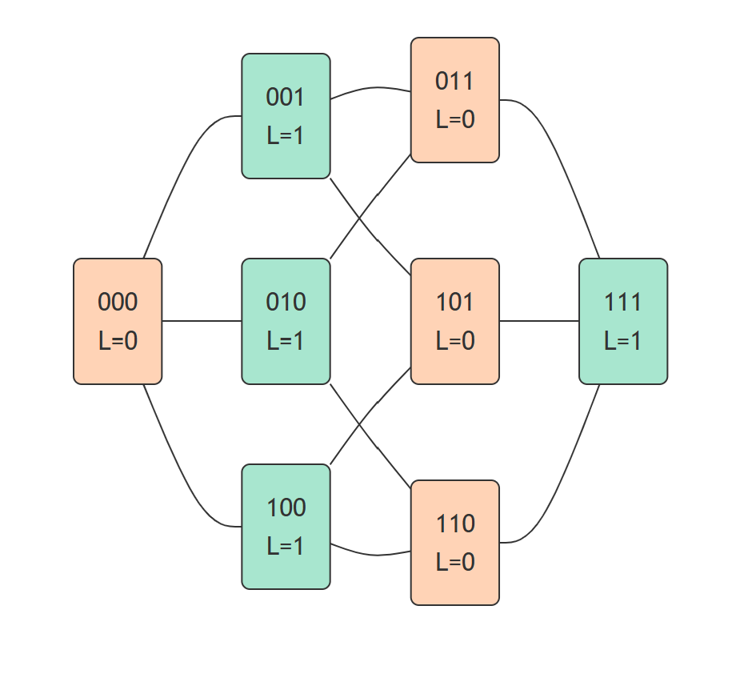{width="4.895869422572178in"
height="4.385448381452319in"}

图20：超立方体结构图

在超立方体中，亮灭状态交错分布：

- 绿色节点（L=1）：001, 010, 100, 111

- 红色节点（L=0）：000, 011, 101, 110

这种交错分布体现了奇偶校验的对称性。

### 3.3 真值颜色矩

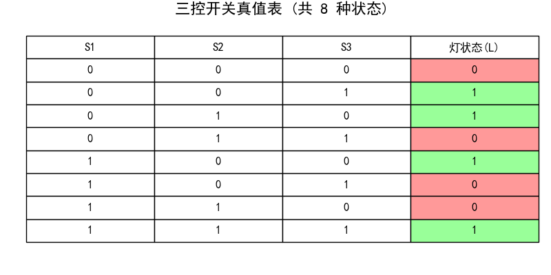{width="6.5in"
height="3.25in"}

图21：三控开关真值表颜色矩阵

该矩阵直观展示了输入组合与输出状态的映射关系：

- 绿色区域（L=1）：奇数个开关闭合，灯亮（4种状态）

- 红色区域（L=0）：偶数个开关闭合，灯灭（4种状态）

颜色映射函数 $C(L)$ 定义如下：

- 当 $L = 1$（奇数个开关闭合，灯亮）时，$C(L) = \text{Green}$（绿色）

- 当 $L = 0$（偶数个开关闭合，灯灭）时，$C(L) = \text{Red}$（红色）

从图中可以清晰看到亮灭状态的交错分布规律，验证了逻辑表达式 $L = S_{1} \oplus S_{2} \oplus S_{3}$ 的奇偶性分布规律。

### 3.2 状态空间拓扑图

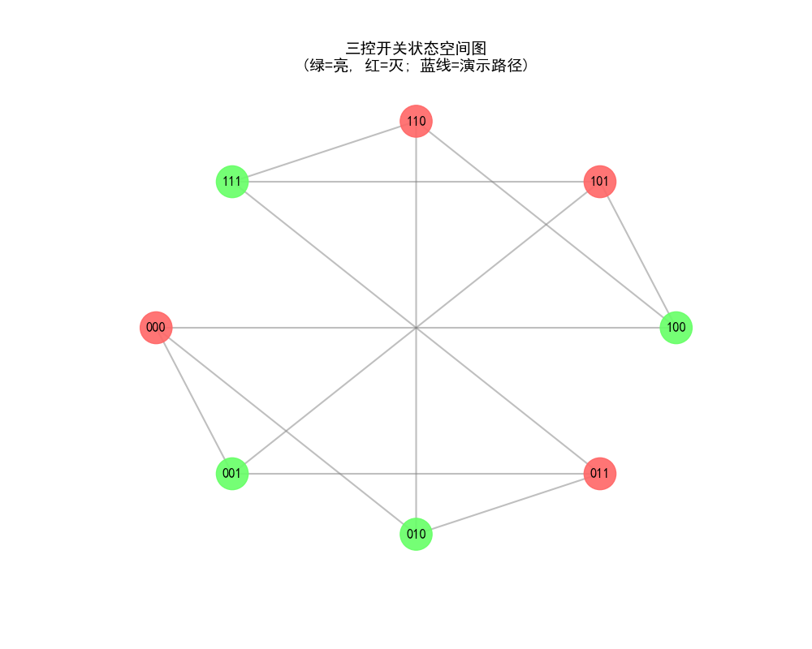{width="6.5in"
height="5.2in"}

图22：三控开关状态空间拓扑图

该图展示了8种状态之间的转换关系：

- 节点：8个顶点代表8种开关组合状态

- 边：汉明距离为1的状态之间有连线（表示可通过切换一个开关到达）

- 节点颜色：根据该状态下的灯亮灭情况（L=1或L=0）进行着色，展示亮灭状态在超立方体上的交错分布

状态空间形成一个三维超立方体结构，亮灭状态在图中交错分布，体现了奇偶校验的对称性。

### 3.3 状态切换路径图

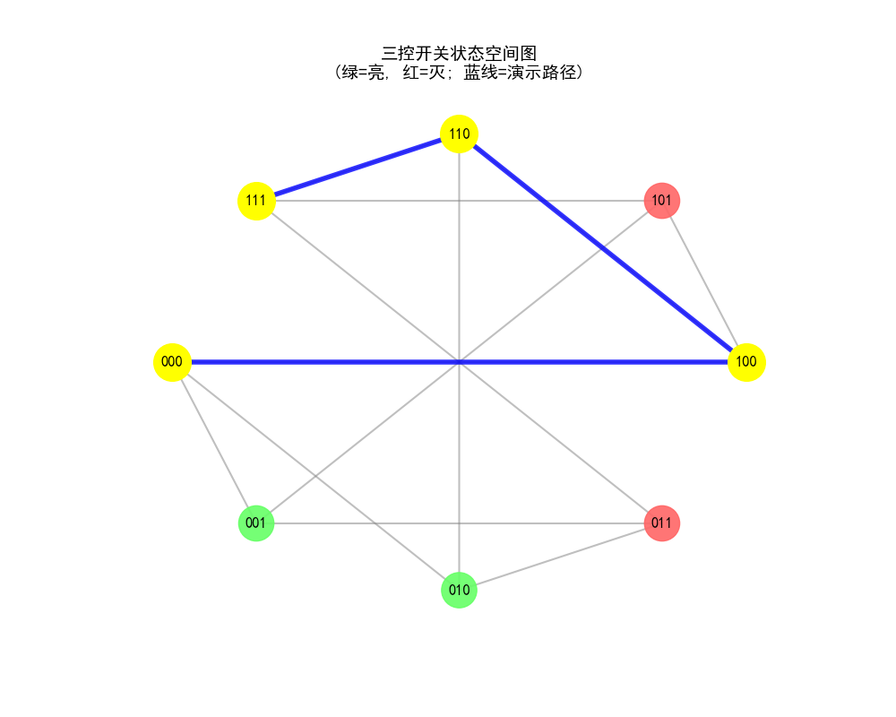{width="6.5in"
height="5.2in"}

图23：状态切换演示路径

该图高亮展示了一条从初始状态(0,0,0)到全闭合状态(1,1,1)的切换路径：

- 黄色节点：路径经过的状态

- 蓝色边：切换操作

演示路径：$\left( 0,0,0) \rightarrow (1,0,0) \rightarrow (1,1,0) \rightarrow (1,1,1 \right)$

每一步切换一个开关，灯的状态依次变化：灭 $\rightarrow$ 亮 $\rightarrow$ 灭 $\rightarrow$ 亮，验证了设计要求。

### 3.4 输出状态分布图

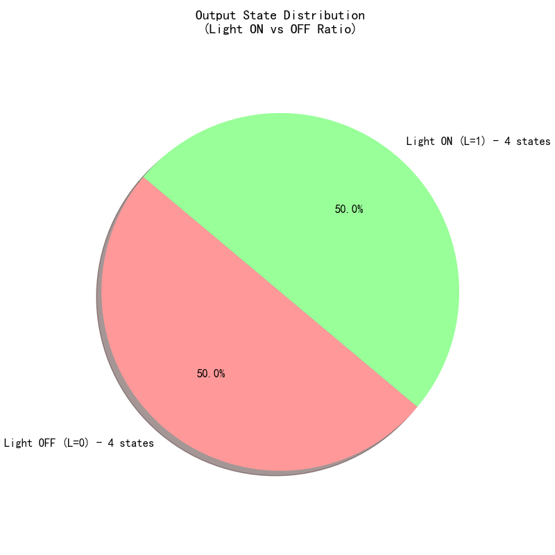{width="6.5in"
height="6.5in"}

> 图24：输出状态分布饼图

该饼图展示了8种状态中灯亮和灯灭的比例：

- 灯亮（L=1）：4种状态（50%）

- 灯灭（L=0）：4种状态（50%）

分布均匀，体现了奇偶校验的对称性。

### 3.5 正确性验证表

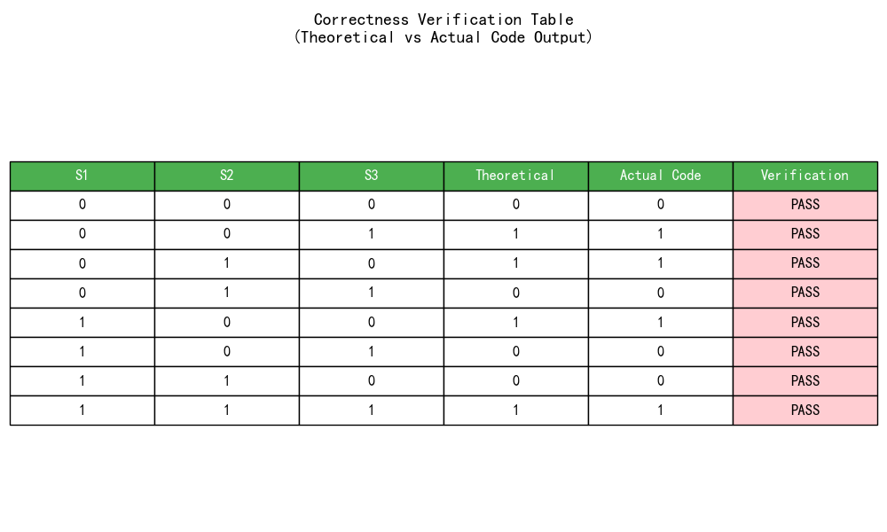{width="6.5in"
height="3.9in"}

图25：正确性验证表

该表将程序输出与理论值进行对比：

- Theoretical：理论值（奇偶校验）

- Actual Code：程序实际输出

- Verification：验证结果（PASS/FAIL）

所有8种状态均验证通过，证明程序实现正确。

## 4. 结果分析

### 4.1 逻辑推导过程

从真值表到布尔表达式的推导：

根据设计要求\"任意开关切换导致灯状态翻转\"，我们可以唯一确定真值表：

> 初始条件：$f(0,0,0) = 0$（全灭时灯灭）
>
> 推导过程：

- 从(0,0,0)出发，切换任意开关，灯必须亮：$f(1,0,0) = f(0,1,0) = f(0,0,1) = 1$

- 从(1,0,0)出发，切换开关2或3，灯必须灭：$f(1,1,0) = f(1,0,1) = 0$

- 从(0,1,0)出发，切换开关3，灯必须灭：$f(0,1,1) = 0$

- 从(1,1,0)出发，切换开关3，灯必须亮：$f(1,1,1) = 1$

> 观察规律：灯亮的状态恰好是奇数个开关闭合的状态
>
> 得出表达式：$L = S_{1} \oplus S_{2} \oplus S_{3}$（异或 = 奇偶校验）

从状态空间到逻辑结构：

状态空间形成三维超立方体，亮灭状态交错分布，体现了奇偶校验的对称性。这种结构保证了任意单步切换都会改变奇偶性，从而翻转灯的状态。

### 4.2 逻辑的正确性

验证方法：将程序输出与理论真值表进行逐行对比。

验证结果：所有8种输入组合的输出都与理论值一致，验证通过。

状态切换验证：对任意状态，切换任意一个开关，灯的状态均发生翻转，满足要求。

### 4.3 布尔表达式分析

表达式简洁性：$L = S_{1} \oplus S_{2} \oplus S_{3}$ 是最简布尔表达式，只需要2个异或门就可以实现。

逻辑可靠性：

- 异或运算具有交换律和结合律，实现简单

- 任意单输入变化必然导致输出变化，鲁棒性强

### 4.4物理意义

奇偶校验解释：灯亮的条件是奇数个开关闭合，这与实际楼道照明的多控需求一致。

对称性：8种状态中，灯亮和灯灭各占4种，体现了逻辑的对称性。

### 4.5结论

\(1\)
设计满足要求：三控开关逻辑 $L = S_{1} \oplus S_{2} \oplus S_{3}$ 满足\"任意开关切换导致灯状态翻转\"的设计要求。

(2)程序实现正确：程序输出与理论真值表一致，验证通过。

(3)可视化有效：状态空间图、真值表矩阵等可视化手段直观展示了逻辑结构，有助于理解系统行为。

(4)表达式最优：异或表达式是最简实现，只需要2个逻辑门，计算效率高。

# 五、任务三：采用Bootstrap方法解决估计问题

## 1. 估计问题与数据说明

### 1.1 估计问题

目标：估计某校全体学生的平均考试成绩（总体均值 $\mu$）。

背景：假设我们无法获取全校所有学生的成绩数据，只能通过随机抽取的 200
名学生作为样本，来推断全校学生的平均考试成绩。由于样本均值 $\overset{ˉ}{x}$ 会因抽样不同而波动，我们需要一种方法来评估这个估计的可靠性------即给出一个置信区间，告诉我们\"总体均值大概落在什么范围内\"。

为什么用
Bootstrap：传统的置信区间计算需要假设数据服从正态分布，但实际数据可能不满足这一假设。Bootstrap
方法不需要对总体分布做任何假设，只需从原始样本中有放回地重抽样，就能近似得到统计量的抽样分布，从而计算置信区间。

### 1.2 数据来源

数据集：Student Exam Scores Dataset（Kaggle）

链接：<https://www.kaggle.com/datasets/mirzayasirabdullah07/student-exam-scores-dataset>

文件：data/sample_data.csv

### 1.3 样本描述

  -----------------------------------------
  项目       说明
  ---------- ------------------------------
  样本量     大约200 名学生

  变量数     6 个

  数据类型   连续型（考试成绩为连续变量）
  -----------------------------------------

### 1.4 变量说明

  ---------------------------------------------------------------------
  变量名               含义                   类型       示例值
  -------------------- ---------------------- ---------- --------------
  student_id           学生编号               标识变量   S001, S002,
                                                         \...

  hours_studied        每周学习时长（小时）   连续变量   1.3 \~ 12.0

  sleep_hours          每晚睡眠时长（小时）   连续变量   4.3 \~ 9.0

  attendance_percent   出勤率（%）            连续变量   50.5 \~ 97.4

  previous_scores      之前的成绩             连续变量   41 \~ 90

  exam_score           考试成绩（目标变量）   连续变量   18.3 \~ 42.0
  ---------------------------------------------------------------------

### 1.5 目标统计量

  -------------------------------------------------------
  统计量     说明
  ---------- --------------------------------------------
  点估计     原始样本的中位数 $\overset{ˉ}{x}$

  置信区间   95% 百分位数置信区间

  估计目标   总体中位数 $M$（全体学生考试成绩的中位数）
  -------------------------------------------------------

### 1.6 估计假设

独立同分布（i.i.d.）：假设 200
个学生的成绩是独立抽取的，每个学生来自同一总体分布。

样本代表性：假设这 200 名学生是全校学生的随机样本，能够代表总体。

有放回抽样：Bootstrap 重采样时，每次从 200 个样本中有放回地抽取 200
个，允许重复。

## 2. Bootstrap方法实现

### 2.1 数学原理

#### 2.1.1 统计泛函

我们感兴趣的总体参数为 $\theta = T(F)$，其中 $F$ 是总体分布，$T$ 是某个统计泛函。统计泛函是把整个分布当作输入，提取出该分布的一个整体特征作为输出。

  ------------------------------------------------------------------------------------------------------------------------------------------
  统计量         总体统计泛函 $T(F)$                                经验统计泛函 $T({\widehat{F}}_{n})$
  -------------- -------------------------------------------------- ------------------------------------------------------------------------
  均值 (Mean)    $$T(F) = \int x\text{ }dF(x)$$                     $$\overset{ˉ}{x} = \frac{1}{n}\sum_{i = 1}^{n}X_{i}$$

  中位数         $$T(F) = \inf\{ x \mid F(x) \geq 0.5\}$$           $T({\widehat{F}}_{n}) = X_{(k)}$，其中 $k = \lceil n/2\rceil$
  (Median)                                                          

  方差           $$T(F) = \int(x - \mu)^{2}\text{ }dF(x)$$          $$s^{2} = \frac{1}{n}\sum_{i = 1}^{n}(X_{i} - \overset{ˉ}{X})^{2}$$
  (Variance)                                                        

  标准差 (Std)   $$T(F) = \sqrt{\int(x - \mu)^{2}\text{ }dF(x)}$$   $$s = \sqrt{\frac{1}{n}\sum_{i = 1}^{n}(X_{i} - \overset{ˉ}{X})^{2}}$$
  ------------------------------------------------------------------------------------------------------------------------------------------

#### 2.1.2 经验分布与重采样

原始样本 $x = (x_{1},\ldots,x_{n})$ 的经验分布函数定义为：

$${\widehat{F}}_{n}(t) = \frac{1}{n}\sum_{i = 1}^{n}1_{\left\{ x_{i}\leq t \right\}}$$

Bootstrap
样本 $x^{*} = (x_{1}^{*},\ldots,x_{n}^{*})$ 是从 ${\widehat{F}}_{n}$ 中独立同分布抽取的，等价于从原始样本中有放回地随机抽取 $n$ 个观测值。

#### Bootstrap 估计

步骤：

（1）重采样：独立地抽取 $B$ 个 Bootstrap
样本，记为 $x^{*(1)},x^{*(2)},\ldots,x^{*(B)}$

（2）计算统计量：对每个 Bootstrap
样本计算相同的统计量 $T(x^{*(b)})$，得到 Bootstrap 复制值：

$${\widehat{\theta}}^{*(1)},{\widehat{\theta}}^{*(2)},\ldots,{\widehat{\theta}}^{*(B)}$$

（3）点估计：通常直接采用原始样本的经验泛函值 $\widehat{\theta} = T({\widehat{F}}_{n})$ 作为 $\theta$ 的点估计。Bootstrap
复制值本身并不直接用于点估计（除非进行偏差校正），它们主要用于评估 $\widehat{\theta}$ 的精度和构建置信区间。

\(4\) 标准误估计：Bootstrap 标准误为所有复制值的样本标准差：

$${\widehat{SE}}_{boot} = \sqrt{\frac{1}{B - 1}\sum_{b = 1}^{B}\left( {\widehat{\theta}}^{*(b)}-{\overset{ˉ}{\theta}}^{*} \right)^{2}},{\overset{ˉ}{\theta}}^{*} = \frac{1}{B}\sum_{b = 1}^{B}{\widehat{\theta}}^{*(b)}$$

\(5\)
置信区间（百分位数法）：取复制值的 $100\alpha/2$ 和 $100(1 - \alpha/2)$ 百分位数作为双侧置信区间：

$$\left\lbrack {\widehat{\theta}}_{(\alpha/2)}^{*},\ {\widehat{\theta}}_{\left( 1-\alpha/2 \right)}^{*} \right\rbrack$$

其中 ${\widehat{\theta}}_{(p)}^{*}$ 表示复制值的第 $p$ 百分位数。

### 核心函数说明

  ---------------------------------------------------------------------------------------------------
  函数名                        功能           参数                               返回值
  ----------------------------- -------------- ---------------------------------- -------------------
  \_resample(data)              有放回重采样   data: 原始样本列表                 重采样后的列表

  generate_distribution(data,   执行完整的     data:                              Distribution 字典
  statistical_function,         Bootstrap 过程 原始样本；statistical_function:    
  iterations,                                  统计量类型；iterations:            
  confidence_quantile, z_score)                重采样次数；confidence_quantile:   
                                               置信区间百分位数；z_score:         
                                               标准差倍数                         
  ---------------------------------------------------------------------------------------------------

generate_distribution 返回值说明：

  ---------------------------------------------------------
  键                        含义
  ------------------------- -------------------------------
  samples                   所有 Bootstrap
                            样本及其统计量的列表

  bootstrap                 所有 Bootstrap 统计量组成的列表

  median                    Bootstrap 统计量的中位数

  point_estimate            原始样本的统计量（点估计）

  standard_error            Bootstrap 标准误差

  standard_error_interval   基于标准误差的区间

  confidence_interval       百分位数置信区间
  ---------------------------------------------------------

### 支持的统计量

程序支持以下统计量的 Bootstrap 估计：

  -------------------------------------------------------------------------------------------------------------
  统计量           函数                                                                  说明
  ---------------- --------------------------------------------------------------------- ----------------------
  均值 (mean)      $$\overset{ˉ}{x} = \frac{1}{n}\sum_{i = 1}^{n}x_{i}$$                 样本平均数

  中位数 (median)  $$X_{\left( \lceil n/2\rceil \right)}$$                               排序后居中的观测值

  方差 (variance)  $$s^{2} = \frac{1}{n}\sum_{i = 1}^{n}(x_{i} - \overset{ˉ}{x})^{2}$$   样本方差（总体形式）

  标准差           $$s = \sqrt{s^{2}}$$                                                  样本标准差
  (standard)                                                                             
  -------------------------------------------------------------------------------------------------------------

### 算法步骤

以1000次重抽样的例子为例：

（1）读取数据：从 data/sample_data.csv 中读取 200
个学生的考试成绩（exam_score）

（2）计算点估计：计算原始样本的中位数 $\widetilde{x}$ 作为总体中位数 $M$ 的点估计

（3）Bootstrap 重采样：

从原始样本中有放回地随机抽取 200 个值，构成一个 Bootstrap 样本

计算该 Bootstrap 样本的中位数

重复上述过程 $B$ 次（$B = 100,500,1000$），得到 $B$ 个 Bootstrap 中位数

（4）计算标准误：计算 $B$ 个 Bootstrap 中位数的标准差作为标准误

（5）计算置信区间：将 $B$ 个中位数从小到大排序，取第 2.5% 和 97.5%
分位数，得到 95% 置信区间

## 3. 可视化验证

### 3.1 运行结果

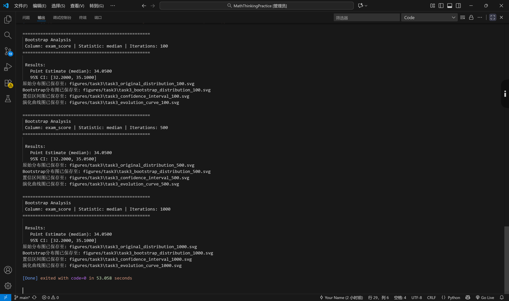{width="6.5in"
height="3.859722222222222in"}

图26：Bootstrap估计运行结果

  -----------------------------------------------------------------------
  **迭代次数**   **点估计（中位数）**       **95% 置信区间**
  -------------- -------------------------- -----------------------------
  100            34.0500                    \[32.2000, 35.1000\]

  500            34.0500                    \[32.2000, 35.0500\]

  1000           34.0500                    \[32.2000, 35.1000\]
  -----------------------------------------------------------------------

### 3.2 B=100可视化结果

#### 3.2.1 原始数据分布图

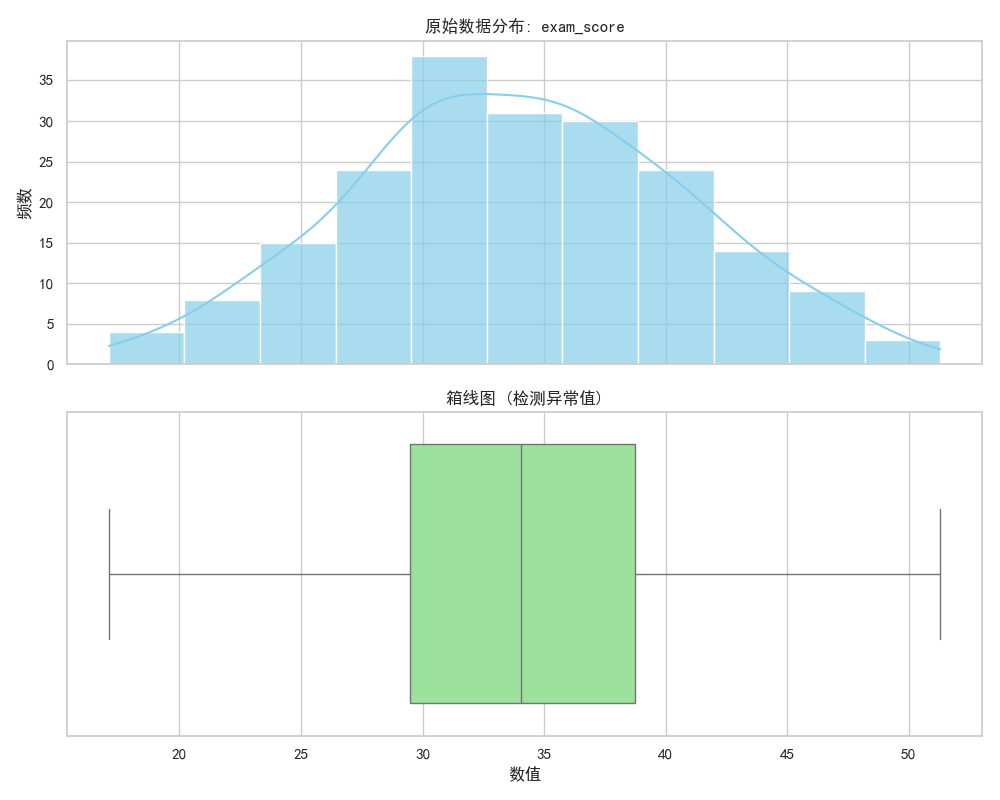{width="6.5in"
height="5.2in"}

> 图27：原始数据分布（B=100）

该图展示了200名学生考试成绩的分布情况。上图为直方图+密度曲线，可观察数据的分布形态；下图为箱线图，用于检测异常值。

#### 3.2.2 Bootstrap抽样分布

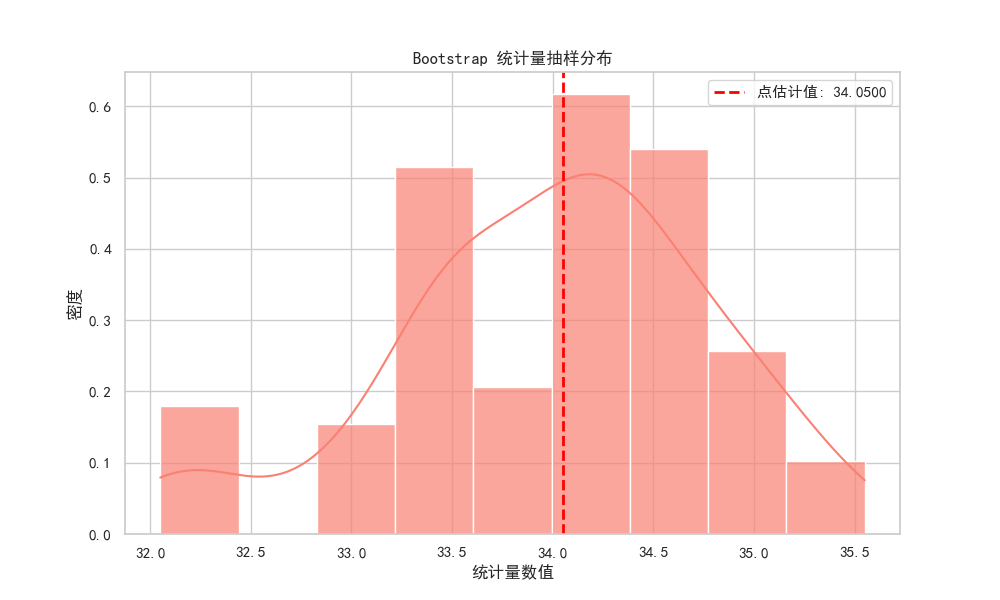{width="6.5in"
height="3.9in"}

> 图28：Bootstrap抽样分布（B=100）

该图展示了100次Bootstrap重采样得到的中位数抽样分布。红色虚线标出了点估计值34.05。

#### 3.2.3 95%置信区间可视化

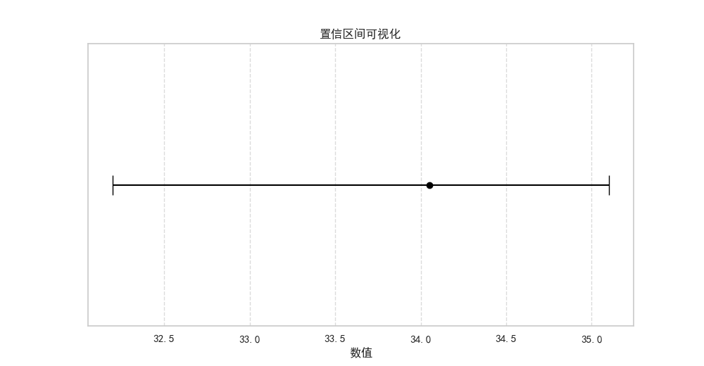{width="6.5in"
height="3.3784722222222223in"}

> 图29：95%置信区间可视化（B=100）

该图直观展示了B=100时Bootstrap方法得到的95%百分位数置信区间\[32.20,
35.10\]。

#### 3.2.4 收敛演化曲线（B=100）

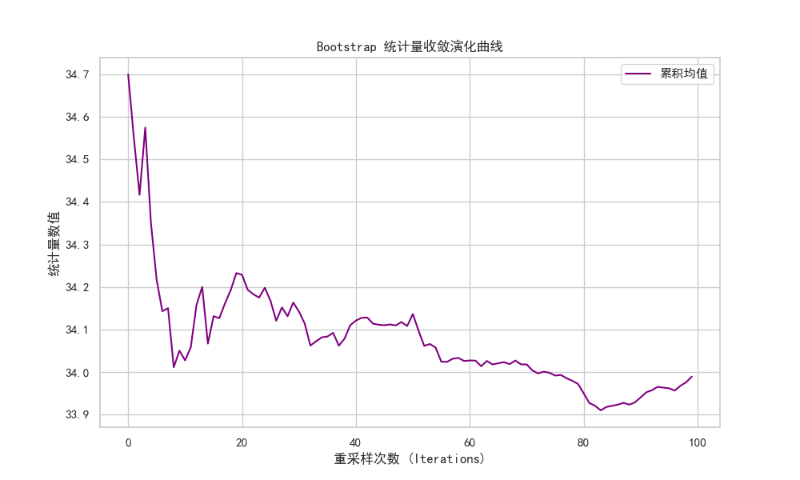{width="6.5in"
height="3.9in"}

图30：收敛演化曲线（B=100）

该图展示了100次重采样过程中统计量的收敛情况。

### 3.3 B=500可视化结果

#### 3.3.1 原始数据分布图

{width="6.5in"
height="5.2in"}

图31：原始数据分布图（B=500）

#### 3.3.2 Bootstrap抽样分布

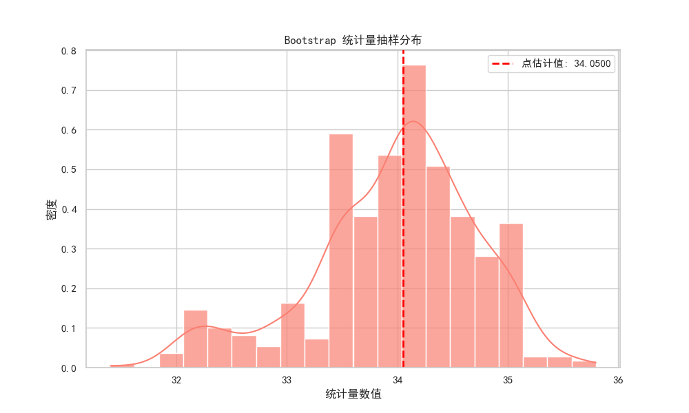{width="6.5in"
height="3.9in"}

> 图31：Bootstrap抽样分布（B=500）

该图展示了500次Bootstrap重采样得到的中位数抽样分布。分布更加平滑，近似正态。

#### 3.3.3 95%置信区间可视化

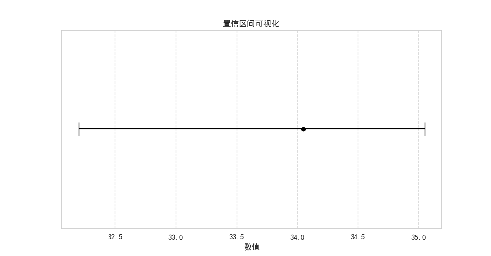{width="6.5in"
height="3.392361111111111in"}

> 图32: 95%置信区间可视化（B=500）

该图展示了B=500时的95%百分位数置信区间\[32.20, 35.05\]。

#### 3.3.5 收敛演化曲线

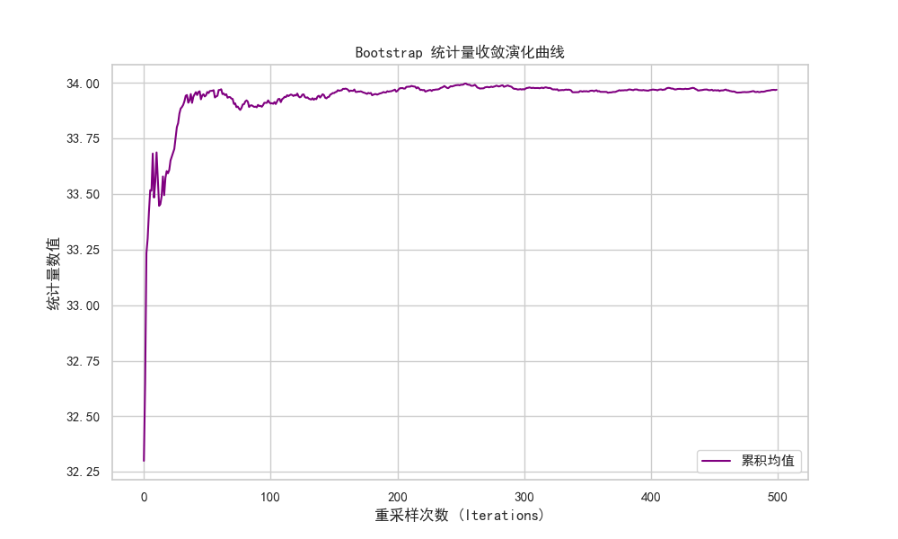{width="6.5in"
height="3.9in"}

> 图33：收敛演化曲线（B=500）

### 3.4 B=1000 可视化结果

#### 3.4.1 原始数据分布图

{width="6.5in"
height="5.2in"}

图34：原始数据分布图（B=1000）

#### 3.4.2 Bootstrap抽样分布

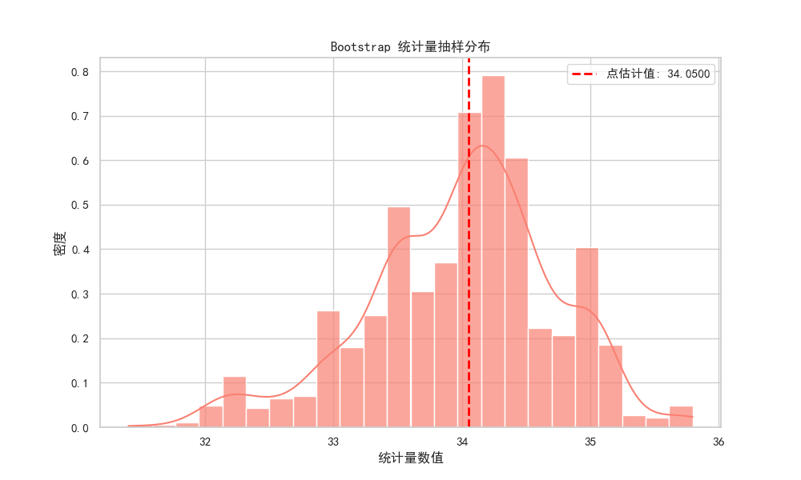{width="6.5in"
height="3.9in"}

> 图35：Bootstrap抽样分布（B=1000）

该图展示了1000次Bootstrap重采样得到的中位数抽样分布。分布最平滑，收敛效果最好。

#### 3.4.3 95%置信区间可视化

{width="6.5in"
height="3.0368055555555555in"}

> 图36：95%置信区间可视化（B=1000）

该图展示了B=1000时的95%百分位数置信区间\[32.20, 35.10\]

#### 3.4.4 收敛演化曲线

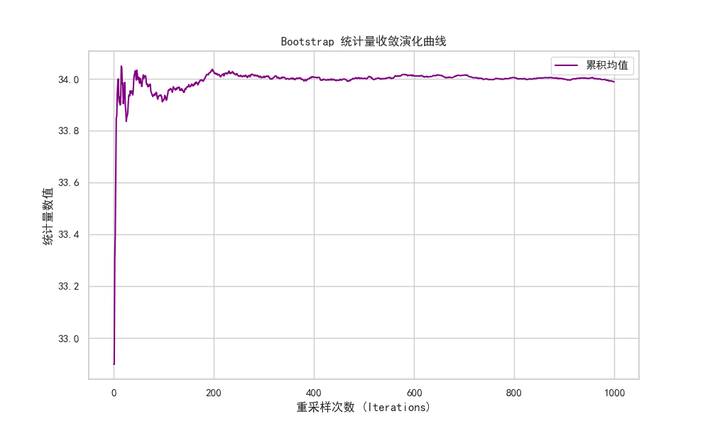{width="6.5in"
height="3.9in"}

图37：收敛演化曲线（B=1000）

## 4. 结果分析

为探究 Bootstrap
重采样次数 $B$ 对估计结果的影响，我们分别设置了 $B = 100$、$B = 500$ 和 $B = 1000$ 三种情况进行对比实验，统计量选择中位数（median）。实验结果如下：

  -----------------------------------------------------
  **迭代次数   **点估计（中位数）**   **95% 置信区间**
  B**                                 
  ------------ ---------------------- -----------------
  100          34.0500                \[32.2000,
                                      35.1000\]

  500          34.0500                \[32.2000,
                                      35.0500\]

  1000         34.0500                \[32.2000,
                                      35.1000\]
  -----------------------------------------------------

### 4.1 点估计的含义

三组实验中，点估计值均为 34.0500，这是原始 200
名学生考试成绩的中位数，作为全校学生考试成绩中位数的最佳单点估计。

点估计不随重采样次数 B 变化，这是因为 Bootstrap
方法的核心作用在于评估估计精度，而非改变点估计本身。无论 B=100、B=500
还是 B=1000，点估计始终来自原始样本，体现Bootstrap
\"以样本推断总体\"的基本思想。

### 4.2 置信区间的含义

置信区间是 Bootstrap 方法的核心输出，它量化了点估计的不确定性。

三组实验的 95% 百分位数置信区间对比：

- B=100 时，95% 置信区间为 \[32.2000, 35.1000\]，宽度为 2.9000

- B=500 时，95% 置信区间为 \[32.2000, 35.0500\]，宽度为 2.8500

- B=1000 时，95% 置信区间为 \[32.2000, 35.1000\]，宽度为 2.9000

置信区间的实际含义：以 B=1000 的结果为例，区间 \[32.20, 35.10\]
表示：如果我们重复进行多次抽样和 Bootstrap 过程，大约 95%
的置信区间会包含真实的总体中位数。换言之，我们有 95%
的把握认为，全校学生考试成绩的中位数落在 32.20 到 35.10 分之间。

### 4.3 估计稳定性分析

> 估计稳定性主要从置信区间宽度和 Bootstrap 分布的收敛性两方面来评估。
>
> 置信区间宽度的稳定性：
>
> 三组实验的置信区间宽度较为接近，B=100 和 B=1000 时宽度均为
> 2.9000，B=500 时略窄为 2.8500。这表明 Bootstrap
> 方法在不同重采样次数下都能给出稳定的置信区间估计。
>
> 重采样次数的影响：

- B=100：重采样次数较少，能给出合理的估计，置信区间 \[32.20, 35.10\]。

- B=500：分布更加平滑，置信区间略有收窄为 \[32.20, 35.05\]，估计更稳定。

- B=1000：分布最平滑，收敛效果最好，置信区间为 \[32.20, 35.10\]。

> 稳定性结论：综合来看，三组实验结果表明 Bootstrap
> 方法在不同重采样次数下都能给出合理的估计，点估计稳定在 34.0500。B=500
> 时置信区间最窄（宽度 2.8500），B=1000
> 时分布收敛最好。实际应用中，建议选择 B≥500 以获得更稳定的估计结果。

### 4.4 Bootstrap 方法适合该问题的原因

（1）无需正态分布假设

传统的置信区间计算（如 t
区间）要求数据服从正态分布，但考试成绩的实际分布可能偏态或有异常值。Bootstrap
方法不依赖任何分布假设，完全由数据驱动，更适合处理实际数据。

（2）样本量适中

本问题大约有 200 个样本，属于中等样本量。Bootstrap 方法在样本量 n≥30
时通常表现良好，200 个样本足以保证重采样的有效性。

（3）估计目标明确

我们需要估计总体中位数，这是一个标准的统计量。Bootstrap
方法对中位数估计效果很好，能够提供可靠的置信区间。

（4）计算简单高效

Bootstrap 方法的实现非常简单：只需重复\"有放回抽样 →
计算统计量\"的过程。对于中位数这种计算量小的统计量，1000
次重采样只需几秒钟即可完成。

（5）提供完整的不确定性量化

Bootstrap
不仅给出置信区间，还提供标准误、分布形状等信息，帮助我们全面了解估计的不确定性。

### 4.5 Bootstrap 方法的局限性

（1）对原始分布的依赖性：Bootstrap
假设样本能代表总体，如果样本有偏或不代表总体，Bootstrap 估计也会有偏差。

（2）小样本偏差：当样本量很小时，经验分布 ${\widehat{F}}_{n}$ 可能与总体分布 $F$ 差异较大，导致
Bootstrap 估计不准确。

（3）极端值敏感：Bootstrap 对极端值敏感，如果样本中存在异常值，Bootstrap
分布可能被拉偏。

（4）不适用于所有统计量：对于某些统计量（如最大值、最小值），Bootstrap
可能不适用或效果较差。

（5）独立性假设：Bootstrap
假设观测值独立同分布，对于时间序列或空间数据，需要使用特殊的 Bootstrap
方法（如 Block Bootstrap）。

### 4.6结论

（1）Bootstrap 方法有效**：**通过 Bootstrap
重采样方法，我们成功估计了全校学生考试成绩的中位数。三组实验均给出了合理的估计结果，点估计稳定在
34.0500。

（2）中位数估计可靠**：**样本中位数 34.0500
是总体中位数的最佳估计，不随重采样次数变化，具有良好的稳定性。中位数作为稳健统计量，不受极端值影响，适合描述成绩的集中趋势。

（3）重采样次数对结果有影响**：**三组实验的标准误和置信区间宽度存在差异，B=1000时
Bootstrap 中位数与点估计完全一致，分布收敛最好。

（4）Bootstrap
方法可扩展**：**本实验仅针对中位数进行估计，如需估计均值、比例等其他统计量，可复用相同的
Bootstrap 框架。

（5）需注意局限性**：**Bootstrap
方法对样本代表性和样本量有一定要求，使用时需谨慎。

# 六、综合讨论

## 1．工程建模角度

三个任务都体现了将实际问题抽象为数学模型的思想：

  --------------------------------------------------------------------------------
  任务     实际问题         数学模型
  -------- ---------------- ------------------------------------------------------
  任务一   金属板温度分布   线性方程组 $Ax = b$

  任务二   三控开关逻辑     布尔逻辑表达式 $L = S_{1} \oplus S_{2} \oplus S_{3}$

  任务三   学生成绩估计     统计推断（Bootstrap 置信区间）
  --------------------------------------------------------------------------------

共性：

- 都需要明确问题的输入、输出和约束条件

- 都需要对实际问题进行简化和假设

- 都需要将连续或离散的实际问题转化为可计算的形式

## 2． 数学方法角度

三个任务分别代表了三个核心数学领域：

线性代数（任务一）：矩阵运算、迭代法、谱理论

离散数学（任务二）：布尔代数、图论、状态空间

概率统计（任务三）：抽样分布、置信区间、Bootstrap 方法

联系：

- 任务一的矩阵 $A$ 可以看作图的邻接矩阵，与任务二的状态空间图有相似的结构。

- 任务三的 Bootstrap
  方法本质上是重采样，与任务一的迭代法有相似的\"重复计算\"思想。

- 三个任务都涉及收敛性分析：任务一关注迭代收敛，任务二关注状态转换的正确性，任务三关注
  Bootstrap 估计的稳定性。

## 3.计算实现角度

三个任务虽然解决的问题不同，但在计算实现上有共同的模式：

(1)迭代与重复：任务一通过迭代法重复计算线性方程组的解直到收敛（误差\<10⁻⁸），任务三通过Bootstrap方法重复重采样B次得到统计量分布，任务二则不需要迭代，通过枚举2³=8种状态直接计算。前两者都体现了\"重复执行直到满足条件\"的计算模式，区别在于任务一有明确的收敛判断，任务三则固定重复次数。

(2)数值计算库：任务一和任务三都依赖NumPy进行数值计算，任务三用np.median、np.percentile、np.std计算统计量和置信区间；任务二则使用纯Python的列表操作和取模运算，体现了不同问题对计算工具的需求差异。

（3）数据结构：任务一处理矩阵（二维数组）和向量（一维数组），任务三处理一维样本数据，任务二处理开关状态列表，反映了不同类型问题的数据组织方式。

（4）算法复杂度：任务一的复杂度取决于矩阵大小和迭代次数（O(n²)每迭代），任务三取决于重采样次数和样本量（O(B×n)），任务二取决于开关个数（O(2ⁿ)枚举所有状态），体现了连续数值计算、统计模拟和离散逻辑计算的复杂度特征差异。

## 4. 可视化表达角度

三个任务都通过可视化来增强理解和验证结果：

  ----------------------------------------------------------------------------
  任务     可视化类型                       作用
  -------- -------------------------------- ----------------------------------
  任务一   热力图、收敛曲线、解对比图       展示矩阵结构、迭代过程、结果验证

  任务二   真值表矩阵、状态空间图、路径图   展示逻辑关系、状态转换、设计验证

  任务三   分布直方图、置信区间图           展示数据分布、估计不确定性
  ----------------------------------------------------------------------------

共性：

- 都使用颜色编码增强信息传达

- 都提供了多个视角的可视化

- 都将可视化结果与理论分析相结合

# 七、总结与改进收获

## 1. 收获

(1)理论与实践结合：通过编程实现数学算法，加深了对理论知识的理解。例如，通过实现
Jacobi 和 Gauss-Seidel 迭代法，直观理解了谱半径与收敛性的关系。

（2）问题建模能力：学会了如何将实际问题抽象为数学模型，并选择合适的求解方法。

（3）编程技能提升：

NumPy 的矩阵运算和线性代数功能

Matplotlib 的高级可视化技巧

Python 的模块化编程和单元测试

（4）数据分析思维：通过 Bootstrap
方法，理解了统计推断的基本思想和置信区间的含义。

（5）团队协作能力：在小组合作中学会了分工协作、代码审查和文档编写。

## 2.遇到的困难以及改进方法

困难1：迭代法实现的性能瓶颈（任务一）

- 问题描述：初始实现迭代求解时，严格照搬教材矩阵推导公式，程序卡顿严重

- 解决过程：分析发现教材中的矩阵形式 $x^{\left( k+1 \right)} = D^{- 1}(L + U)x^{(k)} + D^{- 1}b$ 需要显式构造矩阵 $D^{- 1}(L + U)$，计算复杂度高。改为直接采用计算机实现形式（分量迭代），逐元素更新：

$$x_{i}^{\left( k+1 \right)} = \frac{1}{a_{ii}}\left( b_{i}-\sum_{j \neq i}^{}a_{ij}x_{j}^{(k)} \right)$$

- 结果与反思：数学表达式是理论推导工具，工程实现必须考虑计算复杂度。逐元素更新避免了矩阵构造，大幅提升了性能。

困难2：Bootstrap 大规模重采样的内存溢出（任务三）

- 问题描述：运行 iterations = 10000 时内存占用飙升，程序崩溃

- 解决过程：排查发现代码保留了所有 Bootstrap 样本的原始数据（200×10000
  的数组）。改为只保留每次重采样的统计量（均值），不存储原始重采样数据

- 结果与反思：默认不存储原始重采样数据，可以大幅降低内存开销，提供\"轻量\"模式，只保留必要统计量。

困难3：Bootstrap 置信区间不稳定（任务三）

- 问题描述：test_distribution 输出的百分位数置信区间极不稳定，每次运行结果差异巨大

- 解决过程：查阅 Bootstrap
  理论，确认重采样次数过少导致抽样分布未收敛。逐步增加 iterations（从100到1000到10000），观察标准误差和区间变化，发现
  B=1000 时已基本稳定

- 结果与反思：Bootstrap
  标准误差的稳定性依赖于足够多的重采样次数。在调试阶段固定 random.seed 以便复现，在代码注释和文档中明确各类区间的假设与适用场景。

遗留问题：

- 问题：运行 iterations = 10000 时耗时较长

- 拟解决方案：可考虑使用多进程池并行化重采样与统计计算，或采用 Numba
  加速。

## 3. 改进方向

### 3.1 算法优化

迭代法扩展：实现
SOR（逐次超松弛）迭代法，通过松弛因子加速收敛；实现共轭梯度法，适用于大型对称正定稀疏矩阵；支持预处理技术（如不完全
LU 分解），改善条件数。

Bootstrap 方法扩展：实现
BCa（偏差校正加速）置信区间，提高小样本时的精度；实现 Block
Bootstrap，适用于时间序列等非独立数据；支持 Bootstrap
假设检验，扩展应用场景。

### 3.2可视化增强

交互式可视化：使用 Plotly 或 Bokeh
实现交互式图表，支持缩放、悬停查看详情；添加滑块控制迭代步数，实时观察收敛过程；实现状态空间的
3D 可视化，更直观展示超立方体结构。

动画演示：制作迭代收敛过程的动画，展示误差逐步下降；制作 Bootstrap
重采样的动画演示，直观展示抽样过程；制作状态切换的动态演示，展示灯的亮灭变化。

### 3.3规模扩展

任务一：支持更高维度的网格（如
10×10、100×100），处理更大规模问题；实现非稳态热传导的时域模拟，展示温度随时间演化；支持不规则边界条件，适应更复杂的几何形状。

任务二：支持任意 n
个开关的多控系统，推广到更一般的情况；实现逻辑电路的自动综合，从真值表自动生成电路图；添加故障诊断功能，检测开关故障时的系统行为。

任务三：支持多种统计量的 Bootstrap
估计（中位数、方差、分位数等）；添加贝叶斯推断方法作为对比，展示频率学派与贝叶斯学派的差异。

# 八、参考资料

1\. 知乎专栏. 《线性方程组 Jacobi 与 Gauss-Seidel 迭代收敛原理》

2\. Rosen, K. H. (2019). *Discrete Mathematics and Its
Applications* (8th ed.). McGraw-Hill Education.

3.Efron, B. (1979). Bootstrap Methods: Another Look at the
Jackknife. *The Annals of Statistics*, 7(1), 1-26.

4\. Student Exam Scores Dataset - Kaggle：

<https://www.kaggle.com/datasets/mirzayasirabdullah07/student-exam-scores-dataset>

(任务3使用的数据集)

5.Pandas工具库用来做数据处理，csv文件读取

  --

  --

6\. Claude用来完成数学公式LaTeX格式化

7\. 豆包用来进行任务开始前各个知识点的辅助学习理解。

# 九、附录

## 核心代码：

任务一：**迭代法解线性方程组**

**Jacobi 迭代法实现：**

def \_iterate_jacobi(

coefficient: np.ndarray,

constant: np.ndarray,

old_solution: np.ndarray,

) -\> np.ndarray:

unknown: int = coefficient.shape\[0\]

solution: np.ndarray = np.zeros((unknown,))

for i in range(unknown):

sum_except_diag = (

constant\[i\]

\- np.dot(coefficient\[i, :\], old_solution)

\+ coefficient\[i, i\] \* old_solution\[i\]

)

solution\[i\] = sum_except_diag / coefficient\[i, i\]

return solution

**Gauss-Seidel 迭代法实现：**

def \_iterate_gauss_seidel(

coefficient: np.ndarray,

constant: np.ndarray,

old_solution: np.ndarray,

) -\> np.ndarray:

unknown: int = coefficient.shape\[0\]

solution = old_solution.copy()

for i in range(unknown):

sum1 = np.dot(coefficient\[i, :i\], solution\[:i\])

sum2 = np.dot(coefficient\[i, i + 1 :\], old_solution\[i + 1 :\])

solution\[i\] = (constant\[i\] - sum1 - sum2) / coefficient\[i, i\]

return solution

**谱半径计算：**

def calculate_spectral_radius(

coefficient: np.ndarray,

function: str,

) -\> float:

d_matrix = np.diag(np.diag(coefficient))

l_matrix = -np.tril(coefficient, -1)

u_matrix = -np.triu(coefficient, 1)

iteration = None

match function:

case \"JACOBI\":

iteration = np.linalg.inv(d_matrix) @ (l_matrix + u_matrix)

case \"GS\":

D_minus_L = d_matrix - l_matrix

iteration = np.linalg.inv(D_minus_L) @ u_matrix

case \_:

raise

return np.max(np.abs(np.linalg.eigvals(iteration)))

任务二：**三控开关设计**

def toggle_bit(

switches: list\[int\],

index: int,

) -\> list\[int\]:

new_switches = switches.copy()

new_switches\[index\] = int(not new_switches\[index\])

return new_switches

def get_light(switches: list\[int\]) -\> int:

return sum(switches) % 2

def get_inputs(switch_count: int = 3) -\> list\[list\[int\]\]:

return \[\_parse_value(i, switch_count) for i in
range(2\*\*switch_count)\]

def build_truth_table(switch_count: int = 3) -\>
list\[tuple\[list\[int\], int\]\]:

return \[(x, get_light(x)) for x in get_inputs(switch_count)\]

任务三：**Bootstrap 方法**

statistical_functions: dict\[str, t.Callable\[\[list\[float\]\],
float\]\] = {

\"mean\": lambda x: sum(x) / len(x),

\"median\": lambda x: float(np.median(x)),

\"variance\": lambda x: float(np.var(x, ddof=0)),

\"standard\": lambda x: float(np.std(x, ddof=0)),

}

def \_resample(data: list\[float\]) -\> list\[float\]:

return random.choices(

data,

k=len(data),

)

def generate_distribution(

data: list\[float\],

statistical_function: str = \"mean\",

iterations: int = 1000,

confidence_quantile: tuple\[float, float\] = (2.5, 97.5),

z_score: float = 1,

) -\> Distribution:

statistical = statistical_functions\[statistical_function\]

samples: list\[list\[float\]\] = \[\_resample(data) for \_ in
range(iterations)\]

bootstrap: list\[float\] = \[statistical(x) for x in samples\]

median: float = float(np.median(bootstrap))

point_estimate: float = float(statistical(data))

standard_error: float = float(np.std(bootstrap))

confidence_quantile_lower, confidence_quantile_upper =
confidence_quantile

confidence_interval_lower: float = float(

np.percentile(bootstrap, confidence_quantile_lower)

)

confidence_interval_upper: float = float(

np.percentile(bootstrap, confidence_quantile_upper)

)

return {

\"samples\": samples,

\"bootstrap\": bootstrap,

\"median\": median,

\"point_estimate\": point_estimate,

\"standard_error\": standard_error,

\"standard_error_interval\": (

point_estimate - standard_error \* z_score,

point_estimate + standard_error \* z_score,

),

\"confidence_interval\": (

confidence_interval_lower,

confidence_interval_upper,

),

}
