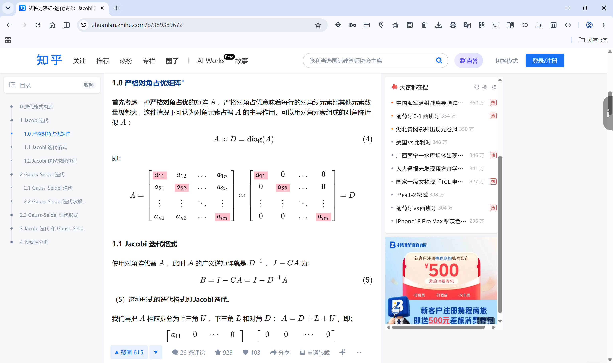
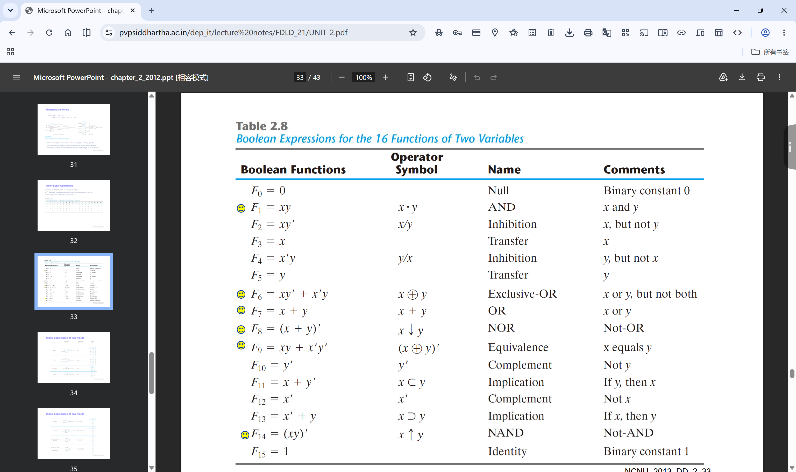
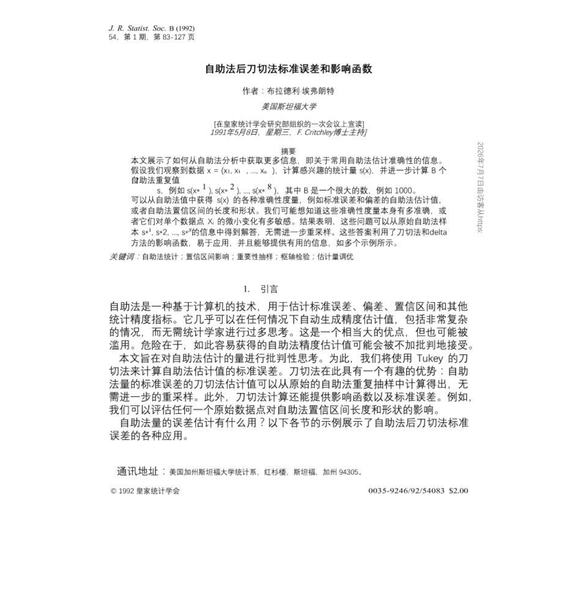
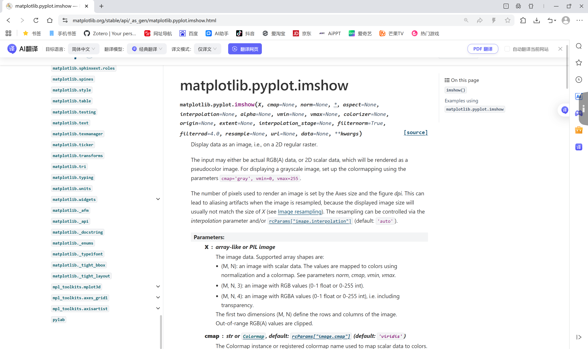
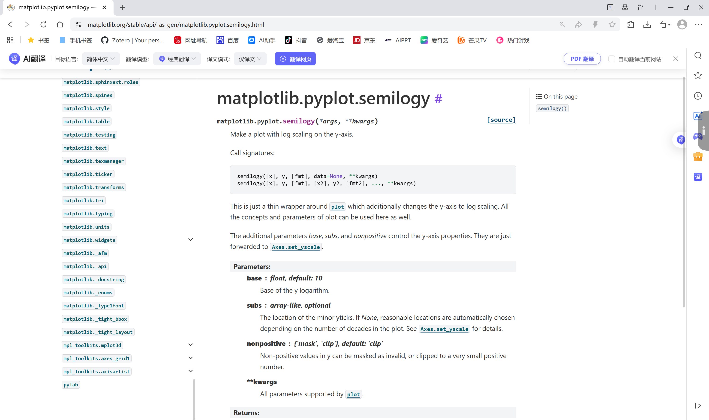
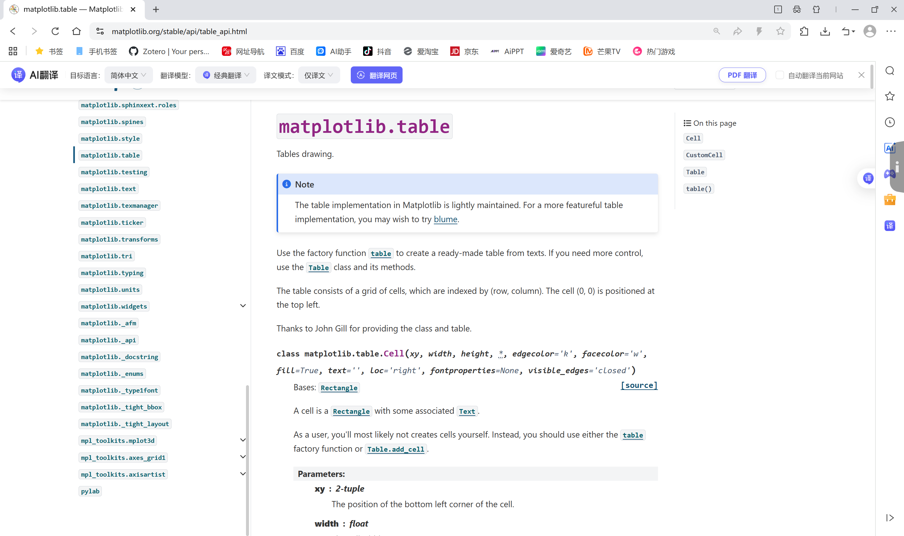
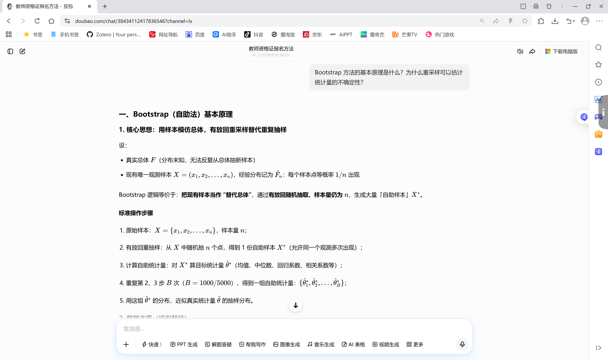

《数学思维实践》课程 CDIO二级项目实践过程模板

学生填写版

课程代码：CST4822A 课程名称：数学思维实践 版本：2026年6月

# 一、基本信息

  -----------------------------------------------------------------------
                 项目                              填写内容
  ----------------------------------- -----------------------------------
               项目名称               

                 组号                                 51

               项目成员                     林颖哲、简铭泽、何思媚

               提交日期               
  -----------------------------------------------------------------------

# 二、记录说明

+----------------------------------------------------------------------------------------------------------+
| 填写提示                                                                                                 |
|                                                                                                          |
| 按时间顺序记录资料查阅、自主学习、问题解决、分工协作和阶段推进情况，内容尽量具体，能够体现项目实施过程。 |
+==========================================================================================================+

# 三、资料查阅与实践过程

## 资料查阅过程

  -----------------------------------------------------------------------------------------------------------------------------------------------------------------------------------------------------------------------------
        时间               学习主题                                                          资料来源                                                                                  学习收获
  ----------------- ---------------------- ------------------------------------------------------------------------------------------------------------ -----------------------------------------------------------------------
       7月1日        迭代法解决线性方程组            Press《Numerical Recipes》、知乎专栏. 《线性方程组 Jacobi 与 Gauss-Seidel 迭代收敛原理》            理解Jacobi和Gauss-Seidel迭代法的数学原理，掌握收敛性判据（谱半径\<1）

       7月2日         布尔代数与逻辑设计                                Rosen《Discrete Mathematics and Its Applications》                                        掌握真值表推导、异或运算性质、超立方体状态空间表示

       7月3日           Bootstrap方法                                   Efron (1979) 论文、Wasserman《All of Statistics》                                        理解Bootstrap重采样原理、百分位数置信区间、标准误计算

       7月3日             数据可视化                                                    Matplotlib官方文档                                                            掌握热力图、折线图、散点图、饼图的绘制方法

       7月4日            Kaggle数据集       [https://www.kaggle.com](https://www.kaggle.com/datasets/mirzayasirabdullah07/student-exam-scores-dataset)                          查找任务三所需的数据集

       7月4日              数据处理                                                       Pandas官方文档                                                                    掌握CSV文件读取、数据筛选与统计
  -----------------------------------------------------------------------------------------------------------------------------------------------------------------------------------------------------------------------------

## 实践过程

  ------------------------------------------------------------------------------------------------------------------------------------------------------------------------------------
      时间          类型                                                         具体内容                                                     参与成员      阶段成果
  ------------ -------------- --------------------------------------------------------------------------------------------------------------- ------------- --------------------------
    6月30日       环境搭建               搭建项目的GitHub仓库、安装NumPy、Matplotlib、NetworkX、Pandas依赖库，运行main.py测试环境             林颖哲        开发环境搭建完成

     7月1日       资料查阅                    阅读任务书，理解三个任务的要求；在知乎专栏. 《线性方程组 Jacobi 与 Gauss-Seidel                 全体成员      明确任务目标和实现思路
                                                          迭代收敛原理》中学习相关知识；查阅Rosen教材学习布尔代数                                           

     7月1日      任务一建模          建立金属板稳态温度分布的线性方程组模型 $Ax = b$，推导9×9系数矩阵A，明确未知量x和右端项b的物理含义        何思媚        完成任务一数学模型层

     7月1日       计算实现                       实现Jacobi和Gauss-Seidel迭代法核心代码，包括分量迭代、LU分解、谱半径计算                     林颖哲        核心算法代码完成

     7月2日        可视化                   可视化同学编写visualize.py代码，生成矩阵热力图、收敛曲线、解对比图、运行时间对比图                简铭泽        任务一可视化完成

     7月2日       结果分析                       完成任务一结果分析：收敛性分析、最终误差验证、收敛速度分析、矩阵性质影响                     何思媚        任务一全部完成

     7月2日       数学建模     推导三控开关的布尔表达式 $L = S_{1} \oplus S_{2} \oplus S_{3}$，建立真值表（8种状态），绘制超立方体状态空间图  林颖哲        完成任务二状态与逻辑建模

     7月2日       计算实现                           组长实现三控开关核心代码，包括真值表生成、状态切换验证、交互模式                         林颖哲        核心算法代码完成

     7月3日        可视化                     可视化同学编写visualize.py代码，生成真值表颜色矩阵、状态空间图、状态切换路径图                  简铭泽        任务二可视化完成

     7月3日       结果分析                      完成任务二结果分析：逻辑正确性验证、逻辑推导过程、布尔表达式分析、物理意义                    何思媚        任务二全部完成

     7月3日       数据准备                         从Kaggle下载Student Exam Scores Dataset，数据集（200个学生，6列数据）                      何思媚        数据集准备完成

     7月4日       计算实现                            实现Bootstrap核心代码，包括重采样、置信区间计算、支持多种统计量                         林颖哲        核心算法代码完成

     7月5日        可视化               编写tasks/bootstrap/visualize.py，生成原始样本分布图、Bootstrap统计量分布图、置信区间示意图           简铭泽        任务三可视化完成

     7月6日       结果分析                     完成任务三结果分析：点估计含义、置信区间含义、Bootstrap方法适用性、局限性分析                  何思媚        任务三全部完成

     7月6日       报告撰写                            整理三个任务的实验报告，撰写综合讨论与总结，补充参考文献和附录                          何思媚        实践报告完成

     7月7日       实践过程                      按模板要求撰写实践过程文档，记录资料查阅、问题解决、分工协作和阶段推进情况                    何思媚        实践过程文档完成
  ------------------------------------------------------------------------------------------------------------------------------------------------------------------------------------

# 四、问题记录与解决

  ----------------------------------------------------------------------------------------------------------------------------------------------------------------------------------------------------------------------------------------------------------------------------------------------------------------------------------------------------------------------------------------
        时间                                        问题描述                                                                                                       解决过程                                                                                                                                      结果与反思
  ----------------- ------------------------------------------------------------------------ ---------------------------------------------------------------------------------------------------------------------------------------------------- ----------------------------------------------------------------------------------------------------------------------------------------
       7月1日              初始实现迭代求解时，严格照搬教材矩阵推导公式，程序卡顿严重                                  分析发现教材中的矩阵形式需要显式构造迭代矩阵，计算复杂度高。改为直接采用分量迭代形式，逐元素更新                                                 数学表达式是理论推导工具，工程实现必须考虑计算复杂度。逐元素更新避免了矩阵构造，大幅提升性能

       7月4日                   运行 iterations = 10000 时内存占用飙升，程序崩溃                         排查发现代码保留了所有Bootstrap样本的原始数据（200×10000的数组）。改为只保留每次重采样的统计量（均值），不存储原始重采样数据                                          默认不存储原始重采样数据，大幅降低内存开销。提供\"轻量\"模式，仅保留必要统计量

       7月4日        test_distribution 输出的百分位数置信区间极不稳定，每次运行结果差异巨大   查阅Bootstrap理论，确认重采样次数过少导致抽样分布未收敛。逐步增加 iterations（从100到1000到10000），观察标准误差和区间变化，发现B=1000时已基本稳定   Bootstrap标准误差的稳定性依赖于足够多的重采样次数。在调试阶段固定 random.seed 以便复现，在代码注释和文档中明确各类区间的假设与适用场景
  ----------------------------------------------------------------------------------------------------------------------------------------------------------------------------------------------------------------------------------------------------------------------------------------------------------------------------------------------------------------------------------------

# 五、分工与协作记录

+-----------------+----------------------------------------------------------------------------------------------------------------------------+--------------------------------------------------------------------+--------------------------------------------------------------------------------------------+
| 成员            | 负责内容                                                                                                                   | 协作情况                                                           | 完成情况                                                                                   |
+:===============:+:==========================================================================================================================:+:==================================================================:+:==========================================================================================:+
| 林颖哲          | 任务一：核心代码 core.py（Jacobi/Gauss-Seidel迭代法、LU分解、谱半径计算）；任务二：状态与逻辑建模、核心代码                | 提供三个任务的核心算法实现，供其他成员调用                         | 代码结构清晰，算法实现正确，运行效率高；主动优化了迭代法的分量实现形式，解决了性能瓶颈问题 |
|                 | core.py（真值表生成、状态切换验证）；任务三：核心代码 core.py（Bootstrap重采样、置信区间计算）                             |                                                                    |                                                                                            |
+-----------------+----------------------------------------------------------------------------------------------------------------------------+--------------------------------------------------------------------+--------------------------------------------------------------------------------------------+
| 简铭泽          | 任务一：可视化代码 visualize.py（矩阵热力图、收敛曲线、解对比图）；任务二：可视化代码                                      | 需要核心代码运行结果和具体数据才能生成图表                         | 图表美观清晰，配色合理，标注完整；能够根据数据分析需求调整可视化方案，有效支撑了结果分析   |
|                 | visualize.py（真值表颜色矩阵、状态空间图、状态切换路径图）；任务三：可视化代码                                             |                                                                    |                                                                                            |
|                 | visualize.py（原始样本分布图、Bootstrap统计量分布图、置信区间示意图）                                                      |                                                                    |                                                                                            |
+-----------------+----------------------------------------------------------------------------------------------------------------------------+--------------------------------------------------------------------+--------------------------------------------------------------------------------------------+
| 何思媚          | 任务一：数学模型层（问题定义、建模假设、多组数据集设计）、结果分析；任务二：结果分析；任务三：估计问题与数据说明、结果分析 | 与林颖哲配合，验证算法正确性；与简铭泽配合，提供数据支持和分析结论 | 数学建模逻辑严谨，分析深入透彻；能够物理角度解释计算结果，结合理论与实践进行综合讨论       |
|                 |                                                                                                                            |                                                                    |                                                                                            |
|                 | 以及实践报告和实践过程报告的撰写                                                                                           |                                                                    |                                                                                            |
+-----------------+----------------------------------------------------------------------------------------------------------------------------+--------------------------------------------------------------------+--------------------------------------------------------------------------------------------+

# 六、阶段性推进记录

  ---------------------------------------------------------------------------------------------------------------------------------------------------------------
        时间              完成内容                                                  阶段成果                                                    下一步计划
  ----------------- -------------------- ----------------------------------------------------------------------------------------------- ------------------------
       6月30日       环境搭建、任务理解                          Python 3.13环境就绪，依赖库安装完成，阅读任务书                          开始数学建模和算法实现

       7月1日         任务一数学模型层    建立线性方程组模型 $Ax = b$，明确矩阵A、向量x和b的物理含义，设计3组数据集（2组收敛、1组发散）       实现迭代法代码

       7月1日          任务一计算实现                         林颖哲完成Jacobi和Gauss-Seidel迭代法实现，验证收敛性                           可视化和结果分析

       7月2日           任务一可视化                           生成矩阵热力图、收敛曲线、解对比图、运行时间对比图                                结果分析

       7月2日          任务一结果分析                                完成任务一结果分析，包括收敛性分析等等                                   任务二逻辑建模

       7月2日          任务二逻辑建模       推导布尔表达式 $L = S_{1} \oplus S_{2} \oplus S_{3}$，建立真值表，绘制超立方体状态空间图             实现代码

       7月2日          任务二计算实现                                完成真值表生成、状态切换验证、交互模式                                       可视化

       7月3日           任务二可视化               生成真值表颜色矩阵、状态空间图、状态切换路径图、输出分布饼图、正确性验证表                    结果分析

       7月3日          任务二结果分析                         完成任务二结果分析：逻辑正确性验证、逻辑推导过程等等                            任务三数据准备

       7月3日          任务三数据准备                          确定Kaggle数据集，下载sample_data.csv，完成数据说明                          实现Bootstrap方法

       7月4日          任务三计算实现                           完成Bootstrap重采样、置信区间计算、支持多种统计量                                 可视化

       7月5日           任务三可视化                        生成原始样本分布图、Bootstrap统计量分布图、置信区间示意图                            结果分析

       7月6日          任务三结果分析                                 完成点估计含义、置信区间含义等的分析                                       报告撰写

       7月6日             实践报告                                           完成整个项目的报告撰写                                            实践过程报告

       7月7日             过程报告                                              完成实践过程报告                                              最终检查与提交
  ---------------------------------------------------------------------------------------------------------------------------------------------------------------

# 七、总结与反思

收获：

(1)理论与实践结合：通过编程实现数学算法，加深了对理论知识的理解。例如，通过实现
Jacobi 和 Gauss-Seidel 迭代法，直观理解了谱半径与收敛性的关系。

（2）问题建模能力：学会了如何将实际问题抽象为数学模型，并选择合适的求解方法。

（3）编程技能提升：NumPy 的矩阵运算和线性代数功能，Matplotlib
的高级可视化技巧，Python 的模块化编程和单元测试

（4）数据分析思维：通过 Bootstrap
方法，理解了统计推断的基本思想和置信区间的含义。

反思：

通过本次数学思维实践项目，我们组认识到数学公式是理论推导的工具，工程实现需要考虑计算复杂度和资源消耗，不能直接照搬教材公式写代码。在任务三的Bootstrap实现中，重采样次数和内存消耗需要平衡，存储原始数据会占用大量内存，只保留统计量就可以满足需求。同时我们也发现在团队协作中，虽然分工明确能提高效率，但需要保持及时沟通，避免因信息不对称导致返工。以及我们也认识到可视化不仅是报告的展示手段，更是理解数据规律和算法特性的重要工具，热力图、收敛曲线、状态空间图等能直观呈现计算结果。同时实践过程应该边做边记录，事后补充容易遗漏细节。

# 八、附录

查阅资料截图：

{width="3.801809930008749in"
height="2.257528433945757in"}

> 线性方程组迭代法资料

{width="3.6838790463692037in"
height="2.1875in"}

> 异或运算布尔函数资料

{width="3.8738145231846017in"
height="4.098958880139983in"}

Bootstrap 相关论文资料

{width="3.8154483814523186in"
height="2.2656255468066493in"}

imshow 二维图像可视化 API

{width="3.8154494750656167in"
height="2.2656255468066493in"}

> semilogy 对数坐标轴绘图接口

{width="3.911928040244969in"
height="2.3229166666666665in"}

matplotlib 表格绘制工具文档

{width="4.254005905511811in"
height="2.526042213473316in"}

> Bootstrap 重采样原理步骤讲解
