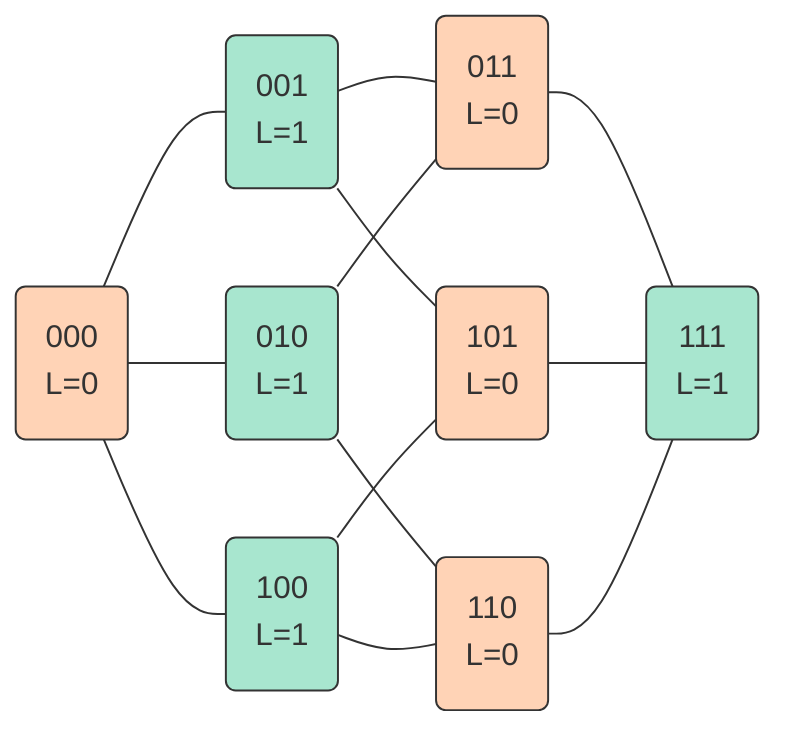
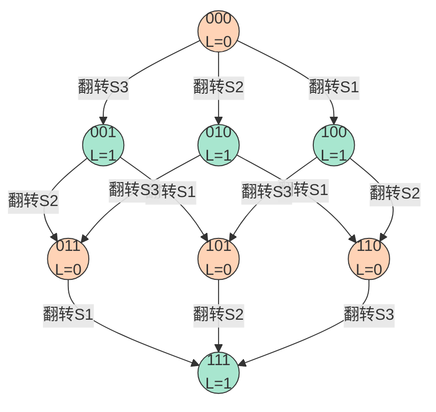
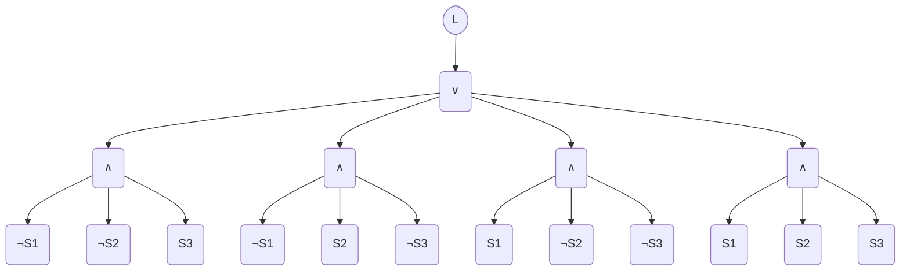
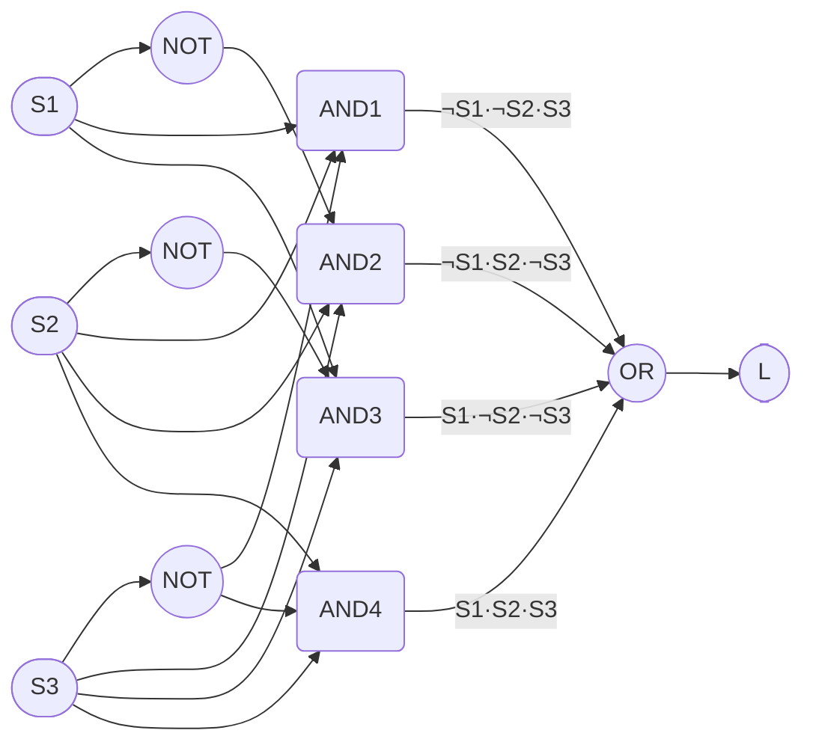
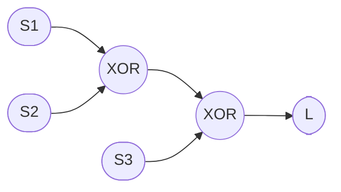

# 任务二：三控开关逻辑系统设计

本模块实现了三控开关 (Three Switch) 的离散逻辑建模、真值表枚举、布尔表达式推导，并提供了完整的程序实现与可视化验证，适用于楼道照明、多控电路等典型场景。

## 数学模型

### 问题表述

设有一个照明灯，由三个开关 $S_1, S_2, S_3$ 共同控制。每个开关为二进制状态：

$$
S_i \in \{0, 1\}, \quad i = 1,2,3
$$

其中 $0$ 表示 “断开”，$1$ 表示 “闭合”。灯的输出状态记为 $L \in \{0,1\}$，$1$ 表示灯亮，$0$ 表示灯灭。

设计

- 灯的状态 $L$ 由三个开关的当前状态共同决定

- 任意一个开关的状态发生切换时，灯的输出状态必须翻转

- 初始状态 (全 $0$) 时灯为灭

## 逻辑原理

### 状态空间与真值表

三个开关共有 $2^3 = 8$ 种输入组合。设输入向量为 $\mathbf {s} = (S_1, S_2, S_3)$，输出 $L = f (\mathbf {s})$。

根据设计要求，$f$ 满足

- $f(0, 0, 0) = 0$

- 对任意 $i$，$f (\mathbf {s} \oplus \mathbf {e}_i) = 1 - f (\mathbf {s})$，其中 $\mathbf {e}_i$ 为第 $i$ 个单位向量
  - 左边 $f (\mathbf {s} \oplus \mathbf {e}_i)$ 表示翻转第 $i$ 个开关之后，灯的新状态

  - 右边 $1 - f (\mathbf {s})$ 表示原来灯的状态取反

由上述条件可唯一确定真值表

```
000 -> 0
001 -> 1
010 -> 1
011 -> 0
100 -> 1
101 -> 0
110 -> 0
111 -> 1
```

观察可知，$L$ 恰好等于三个开关状态的奇偶校验 (模 2 和)：

$$
L = S_1 \oplus S_2 \oplus S_3
$$

### 结构可视化

#### 超立方体结构图



#### 完整状态转换表



#### 布尔表达式结构图



### 布尔逻辑表达式

将异或展开为与或式 (析取范式)：

$$
L = (\overline{S_1} \overline{S_2} S_3) \vee (\overline{S_1} S_2 \overline{S_3}) \vee (S_1 \overline{S_2} \overline{S_3}) \vee (S_1 S_2 S_3)
$$



亦可等价写为：

$$
L = S_1 \oplus S_2 \oplus S_3
$$



该表达式清晰地表明：灯的亮灭由三个开关中处于闭合 (1) 状态的个数决定 —— 奇数个闭合则灯亮，偶数个闭合则灯灭。因此，任意一个开关翻转都会改变奇偶性，从而翻转灯的状态，符合设计要求。

## 计算实现

### 灯状态计算

给定开关向量 $\mathbf {s}$，灯状态 $L$ 由奇偶校验给出：

$$
L = \left( \sum_{i = 1}^{n} S_i \right) \bmod 2
$$

### 开关翻转操作

对当前开关向量 $\mathbf {s}$，翻转第 $i$ 个开关得到新向量：

$$
\mathbf {s}' = \mathbf {s} \quad \text {但} \quad S'_i = 1 - S_i
$$

翻转后的灯状态应满足 $L' = 1 - L$，用于验证正确性。

## 扩展实现

本设计不仅适用于 3 个开关，也可推广至任意 $n$ 个开关的多控系统，只要将灯状态定义为所有开关的异或和：

$$
L = \bigoplus_{i = 1}^{n} S_i
$$

此时任意一个开关翻转，灯状态必然翻转，因此该逻辑天然满足 “多控” 需求。

## 核心函数说明

### `toggle_bit`

- 说明：复制当前开关列表，并将指定索引处的位取反，返回新列表。

- 参数：
  - `switches` – 当前开关状态列表

  - `index` – 要翻转的开关索引

- 返回：翻转后的新列表

### `get_light`

- 说明：根据开关状态计算灯的输出。

- 参数：
  - `switches` – 开关状态列表

- 返回：灯的状态

### `get_inputs`

- 说明：生成所有可能的输入组合。

- 参数：
  - `switch_count` – 开关个数

- 返回：包含所有组合的列表，每个组合为一个长度为 `switch_count` 的列表

### `build_truth_table`

- 说明：构建完整的真值表。对于每一种输入组合，计算对应的灯状态。

- 参数：
  - `switch_count` – 开关个数

- 返回：包含 8 个元组的列表，每个元组为 `(switches, light)`

## 可视化实现

  本模块基于 matplotlib 和 networkx 库，旨在将三控开关的抽象逻辑状态映射为直观的几何图形与数据矩阵，验证状态空间的连通性及逻辑函数的奇偶校验特性。

### 真值表颜色矩阵 (Truth Table Matrix)

  为了直观展示输入组合与输出状态的映射关系，我们将真值表渲染为热力图矩阵。设输入状态集合为 S = {0, 1}^3，输出状态为 L ∈ {0, 1}。在可视化矩阵中，定义颜色映射函数 C(L) 如下：

    当 L = 1 (奇数个开关闭合，灯亮) 时，C(L) = Green (绿色)

    当 L = 0 (偶数个开关闭合，灯灭) 时，C(L) = Red (红色)

  该矩阵直观地验证了逻辑表达式 L = S1 ⊕ S2 ⊕ S3 的奇偶性分布规律。

### 状态空间拓扑图 (State Space Topology)

  三控开关系统的状态空间本质上是一个三维超立方体（3-Cube）图结构 G = (V, E)。

  顶点集 V：包含 2^3 = 8 个顶点，每个顶点 v ∈ {0, 1}^3 代表一种开关组合状态。

  边集 E：若两个状态 u, v ∈ V 的汉明距离为 1，即 d_H(u, v) = Σ |ui - vi| = 1，则两点之间存在一条边。这代表通过拨动任意一个开关即可实现状态跳转。

  在生成的拓扑图中：

    节点颜色：根据该状态下的灯亮灭情况（L=1 或 L=0）进行着色，展示亮灭状态在超立方体上的交错分布。

    路径高亮：支持传入状态序列 P = {v_start, ..., v_end}，在图中高亮显示特定的操作路径。

### 核心代码逻辑说明

  plot_truth_table_matrix(states, labels)：接收状态列表，生成 8x4 的热力图并保存至 figures/truth_table_matrix.png。

  plot_state_space_graph(highlight_path=None)：构建 3D 立方体布局。若传入 highlight_path 参数（如演示从全0到全1的过程），函数会在图中用黄色粗线标出该路径，其余边保持灰色半透明，以突出显示状态流转过程。
​
